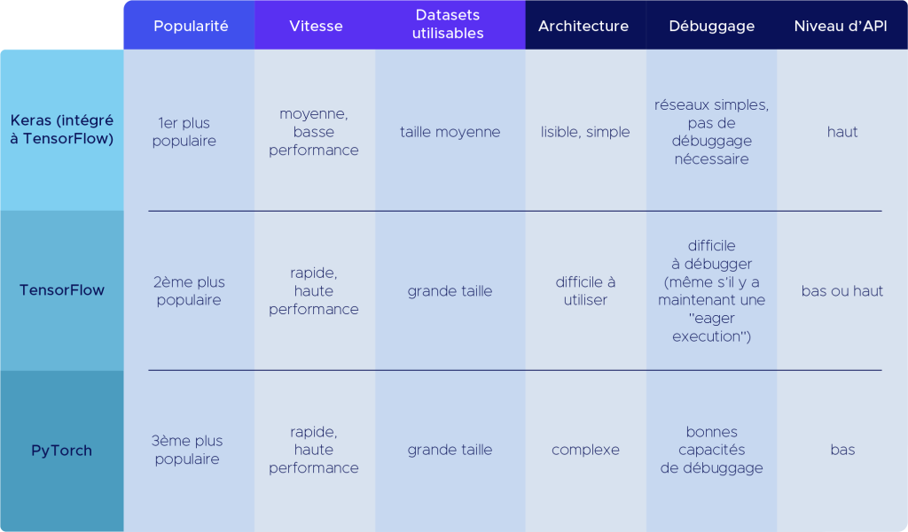

-------------------------------------------------------------------------------

PyTorch est une bibliothèque logicielle Python open source d'apprentissage
machine qui s'appuie sur *Torch* développée par Meta. Elle a été lancée
officiellement en **2016** par une équipe du laboratoire de recherche de
Facebook, et est depuis développé en open source. L’objectif de ce framework
est de permettre l’implémentation et l’entraînement de modèles de
**Deep Learning** de manière simple et efficace.

Pytorch est aujourd’hui utilisé par *17%* des développeurs Python
([étude Python Foundation 2020](https://www.jetbrains.com/lp/python-developers-survey-2020/)),
et dans de nombreuses entreprises comme *Tesla*, *Uber* etc.

 

    
Table des Contenus

    <ul>
        <li><a href="#avant-propos">Avant propos</a> </li>
        <li><a href="#prérequis">Prérequis</a> </li>
        <li><a href="./intro/README.md">Introduction</a>
            <ul>
                <li><a href="./intro/README.md#pourquoi-pytorch-">Pourquoi PyTorch ?</a></li>
                <li><a href="./intro/README.md#utilisation-de-pytorch">Utilisation de PyTorch</a></li>
                <li><a href="./intro/README.md#avantages-de-pytorch">Avantages de PyTorch</a></li>
            </ul>
        </li>
        <li><a href="./install/README.md">Installation et configuration</a></li>
            <ul>
                <li><a href="./install/README.md#sous-linux">Sous Linux</a></li>
                <li><a href="./install/README.md#sous-windows-et-mac">Sous Windows et Mac</a></li>
            </ul>
        </li>
        <li><a href="./tensor/README.md">Introduction au Tenseur</a>
            <ul>
                <li><a href="./tensor/README.md#création-de-tenseur">Création de Tenseur</a></li>
                <li><a href="./tensor/README.md#opération-sur-les-tenseur">Opération sur les tenseur</a></li>
                <li><a href="./tensor/README.md#g%C3%A9n%C3%A9rations-al%C3%A9atoires">Générations aléatoires</a></li>
            </ul>
        </li>
        <li><a href="./nn/README.md">Réseaux de neuronnes</a>
            <ul>
                <li><a href="./nn/README.md#le-perceptron">Le perceptron</a></li>
                <li><a href="./nn/README.md#fonction-dactivation">Fonction d'activation</a></li>
                <li><a href="./nn/README.md#fonction-de-perte">Fonction de perte</a></li>
                <li><a href="./nn/README.md#apprentissage-supervis%C3%A9e">Apprentissage supervisée</a></li>
            </ul>
        </li>
        <!--<li><a href="./intro/README.md">Introduction</a>
            <ul>
                <li><a href="./intro/README.md#pourquoi-pytorch">Pourquoi PyTorch ?</a></li>
            </ul>
        </li>
        <li><a href="./tensor/README.md">Introduction au Tenseur</a>
            <ul>
                <li><a href="./tensor/README.md#création-de-tenseur">Création de Tenseur</a>
                    <ul>
                        <li><a href="./tensor/README.md#scalaire">Scalaire</a></li>
                        <li><a href="./tensor/README.md#vecteur">Vecteur</a></li>
                    </ul>
                </li>
            </ul>
        </li>-->
    </ul>

## Avant propos
D'autres framework ont été créés à quelques années d’intervalle avec
sensiblement le même objectif mais avec des méthodes différentes.
On va juste parler des plus populaires comme TensorFlow et Keras.

*Keras* a été développé en mars 2015 par François Chollet, chercheur chez
Google. Keras a vite gagné en popularité grâce à son API facile à utiliser,
qui s’inspire grandement de *scikit-learn*, la librairie de Machine Learning
standard de Python.

Quelques mois plus tard, en novembre 2015, Google a publié une première
version de TensorFlow qui est vite devenu le framework de référence en
Deep Learning, car il permet d’utiliser Keras. Tensorflow a également mis
au point un certain nombre de fonctionnalités en apprentissage profond dont
les chercheurs avaient besoin pour créer facilement des réseaux de neurones
complex.

Keras était donc très simple à utiliser, mais n’avait pas certaines
fonctionnalités « bas niveau » ou certaines personnalisations nécessaires
aux modèles de pointe. À l’inverse, Tensorflow donnait accès à ces fonctions,
mais ne ressemblait pas au style habituel de Python et avait une documentation
très compliquée pour les néophytes.

> Le mot **néophytes** est utilisé pour qualifier une personne qui a récemment
adhéré à une doctrine, un parti, une association. Dans notre cas ici, on
veut parler des nouveaux utilisateurs de Tensorflow.

**PyTorch a résolu ces problèmes** en créant une API à la fois accessible et
facile à personnaliser, permettant de créer de nouveaux types de réseaux,
des optimiseurs et des architectures inédites.

Ceci-dit, les évolutions récentes de ces frameworks ont grandement rapproché
leur mode de fonctionnement. Avant de rentrer dans les détails techniques de
PyTorch, voici un tableau récapitulatif des différences entre ces outils.
Keras et Tensorflow fonctionnant dorénavant de pair, il est plus pertinent de
les présenter conjointement.

###### FIGURE 01

<i>
<ins>Figure 01</ins> : Tableau de comparaison des performances de chacune des
trois (03) frameworks.
</i>

Ce cours porte sur les techniques de représentation et d’apprentissage profond
les plus récentes. Je te parlerai un peu des différentes méthodes
d'apprentissage comme l’apprentissage supervisé, non supervisé et par
renforcement et comment les utiliser avec le framework PyTorch à travers des
exemples d'applications comme la vision par ordinateur, le traitement de
langue naturelle, la reconnaissance vocale, les systèmes de recommandations,
et les systèmes de résolutions de problèmes
(états - actions - récompenses) comme les IA gameur. Pour pouvoir mieux me
suivre dans ce cours, je te recommande d'avoir certains prérequis comme ceux
que j'ai énuméré dans [la section suivante](#pr%C3%A9requis).

## Prérequis
1. Avoir quelque notion de base en mathématique.
2. Savoir écrire des algorithmes et programmer dans un langage de
programmation.
3. Savoir programmer en langage **Python**.
4. Maîtriser les bases de la programmation orientée objet (**POO**).
5. Même si ce n'est pas obligatoire avant de commencer ce cour,
il faut au moins avoir suivie un cour sur les bases du **deep learning**
ailleurs qu'ici. Car je ne vais pas trop m'attarder sur ces notions de base.

 
 

[:arrow_backward: Racine](../README.md)
| [**Introduction :arrow_forward:**](./intro/README.md)

