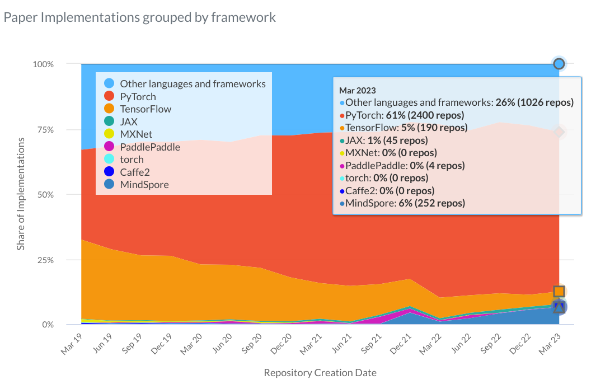

## Introduction

Ce cours ne remplace pas tout ce qui se trouve sur cette
[page d'accueil](https://pytorch.org/docs/stable/index.html).
Il devrait être ta référence pour tout ce qui concerne Pytorch.
Avant que je ne commence les bonnes choses, je te propose de jetter d'abord
un coup d'œil aux
[papiers with code](https://paperswithcode.com/trends). Au cas où, tu ne sais
pas ce que c'est, il s'agit d'un site web qui recense les frameworks les plus
récents et les plus importants sur le machine learning et qui indique s'ils
contiennent ou non des dépôts de code.

###### FIGURE 01

<i>
<ins>Figure 01</ins> : Voici à quoi il ressemble à l'heure où je rédige ce
chapitre introductif, lorsque je place ma souris sur le sommet qui se trouve
en haut et à droite du grand rectangle.
</i>

Sur ce site, tu trouveras des informations sur
d'autres langages, d'autres frameworks de deep learning, *PyTorch*,
*TensorFlow*, *Jax*, *MXNet*, *PaddlePaddle*, le *torch* original, etc.
La courbe orange est pour le framework PyTorch.
Ce dernier est une évolution de torch écrite en Python. Si tu regardes les
informations de Mars 2023, **PyTorch se trouve 61% avec 2400 dépôts de
code**. Donc, il s'agit, de loin, du framework de recherche le plus populaire
en matière de machine learning, utilisé pour écrire le code des algorithmes
d'apprentissage automatique de pointe.

> Wow, la vâche !!! C'est géniale ! :nerd_face:

Là, je sent que tu es motivé ! :blush:

 

    
Table des Contenus

    <ul>
        <li><a href="#pourquoi-pytorch-">Pourquoi PyTorch ?</a></li>
        <li><a href="#utilisation-de-pytorch">Utilisation de PyTorch</a></li>
    </ul>

[:house: **Retour à l'accueil**](../README.md)

### Pourquoi PyTorch ?
> Quelle question ! :grin:  
Il n'y a plus à trop réfléchir. D'après les statistiques,
PyTorch écrase tous le reste. Sans l'ombre d'un doute, c'est PyTorch il faut
choisir.

Oui, je sais, après avoir vu les statistiques, pour toi la question n'a plus
lieu d'être. Mais, je vais quand y répondre.

PyTorch est utilisé pour les modèles de vision
par ordinateur des voitures autonomes de Tesla.

<i>
<ins>Figure 02</ins> : Une voiture autonome.
</i>

OpenAI, qui est l'une des plus grandes entreprises ouvertes de recherche en
intelligence artificielle (ouverte dans le sens où elle publie un grand
nombre de ses méthodologies de recherche) en a récemment fait l'objet d'un
débat. Mais si tu vas sur [openai.com](https://openai.com), disons qu'il s'agit
de l'une des plus grandes entités de recherche en IA au monde, et qu'ils ont
standardisé dans PyTorch. Car, l'article de blog de janvier 2020 indique
qu'OpenAI est désormais standardisé dans PyTorch. Il y a un repo appelé
l'[**incroyable PyTorch**](https://github.com/ritchieng/the-incredible-pytorch)
qui rassemble tout un tas de projets différents
qui sont construits au-dessus de PyTorch. La beauté de Pytorch réside dans
le fait que l'on peut l'utiliser pour construire des systèmes d'intelligence
artificielle pour l'agriculture.

> C'est vrai ? :grinning:

Biensûr que si. Les robots utilisés en agriculture de nos jour, utilisent
PyTorch pour leur modèle d'apprentissage machine. Si tu tape sur Google
"**AI for AG**", parmit les résultats, tu trouveras ce
[lien](https://medium.com/pytorch/ai-for-ag-production-machine-learning-for-agriculture-e8cfdb9849a1).

### Utilisation de PyTorch
Ce framework est pensé pour minimiser le temps de calcul et exploiter au mieux
les capacités du hardware. Il représente les données et les modèles sous forme
de tableaux multidimensionnels, similaires aux tableaux NumPy, appelés
**tenseurs**. à partir de ces derniers, PyTorch effectue, de manière cachée et
efficace 4 étapes pour entraîner un modèle de réseau de neurones, à savoir :

1. **Construire un graphe de calcul** à partir des tenseurs du réseau de
neurones. Ce qui permet d'avoir une structure dynamique dans laquelle
il est possible de modifier le réseau de neurones (nombre de noeuds, connexions
entre eux, ...) au cour du processus d'apprentissage.

2. **Effectuer les prédictions** ("Forward propagation").

3. **Calculer la perte** ou erreur de prédictions.

4. **Calculer les gradients** de l'erreur par rapport à paramètre du réseau de
neurones. Cette opération s'appelle "Backward propagation".

5. **Mise à jour des paramètres** du réseau avec les différentes valeurs de
gradients calculées en ajustant les tenseurs qui le représentent. Cette
dernière étape permet au réseau d'améliorer la précision de ces futures
prédictions.

Récemment, et en partenariat avec AWS (Amazon Web Services), PyTorch
a devoilé 2 nouvelles fonctionnalités. La première, baptisée `TorchServe`,
permet de gérer efficacement le déploiement de réseaux de neurones déjà
entraînés. La seconde, `TorchElastic`, permet d’utiliser Pytorch sur des
clusters **Kubernetes** tout en étant résistant aux pannes.

> **Kubernetes**, devenu un outil indispensable en Data Science, est une
plateforme open source, conçu pour gérer des conteneurs et des clusters depuis
une interface unique et centralisée. Il est possible de déployer des
conteneurs sur tous types d’environnements : Cloud, machines virtuelles,
machines physiques, etc... afin de créer un réseau de machines virtuelles.
Pour plus d'informations sur Kubernetes, suis cette
[🎞 vidéo](https://youtu.be/NChhdOZV4sY).

 
 

[:arrow_backward: Accueil](../README.md)
| [**Installation et configuration :arrow_forward:**](../install/README.md)

