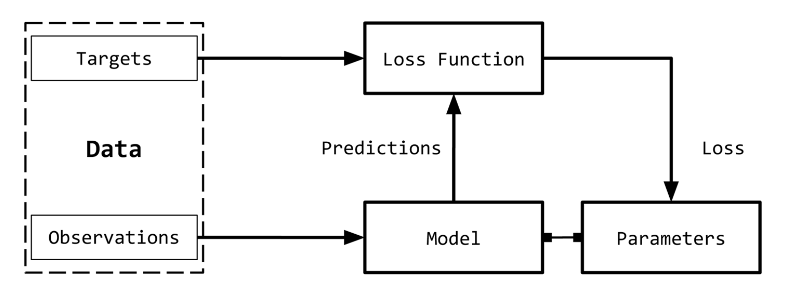
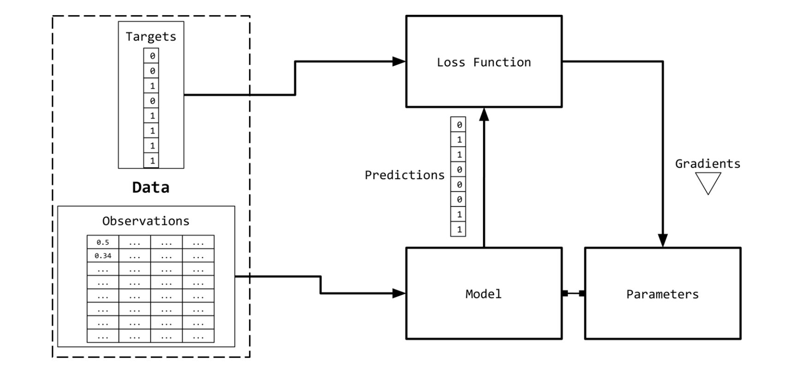
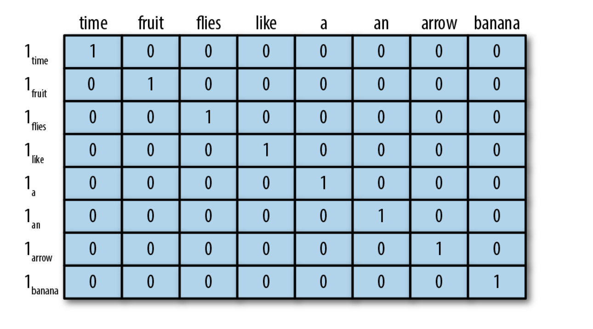
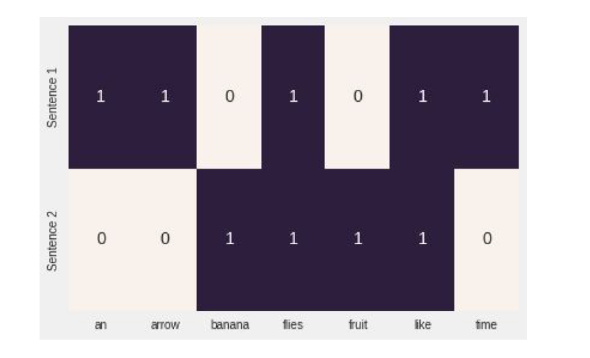
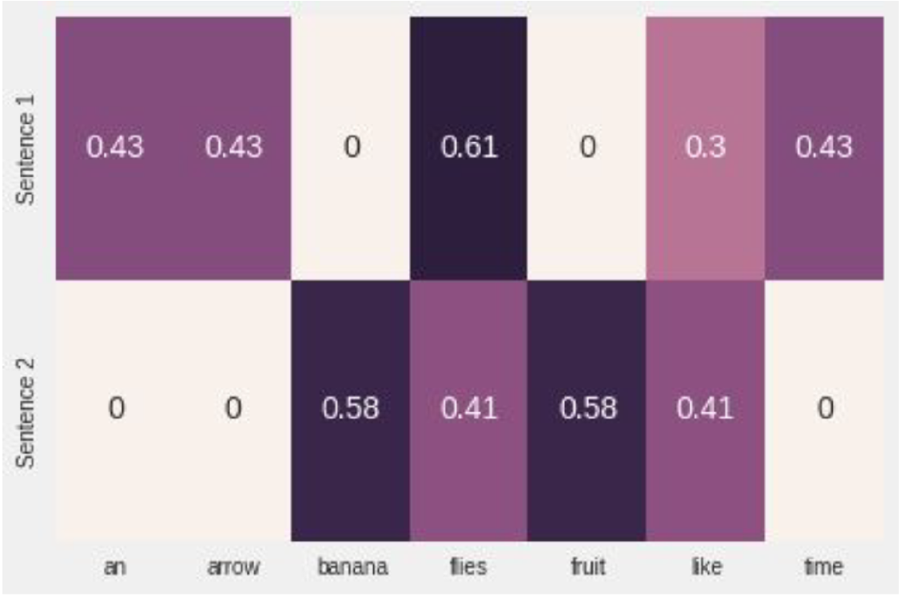
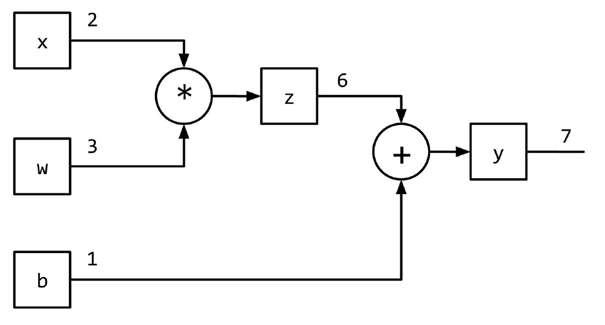

## Introduction au NLP


Les noms courants comme Echo (Alexa), Siri et Google Translate ont au moins
une chose en commun. Ce sont tous des produits dérivés de l'application du
traitement du langage naturel (NLP : *Natural Language Processing*). L'un des
deux sujets principaux de ce chapitre. Le NLP se réfère à un ensemble
de techniques impliquant l'application de méthodes statistiques, avec ou sans
l'aide de la linguistique, pour comprendre les textes afin de résoudre des
tâches du monde réel. Cette "compréhension" du texte par la machine est
principalement obtenue en transformant les textes en représentations
informatiques utilisables, comme des structures combinatoires discrètes
ou continues telles que vecteurs ou tenseurs, les graphes et les arbres.

La construction de représentations adaptées à une tâche à partir de données
(du texte dans le cas présent) est le sujet de l'apprentissage automatique.
L'application de l'apprentissage automatique aux données textuelles remonte à
plus de trente ans, mais au cours des 10 dernières années, un ensemble de
techniques d'apprentissage automatique connues sous le nom de *Deep learning*
ont commencé à se révéler très efficaces pour diverses tâches d'intelligence
artificielle (IA) dans les domaines du NLP, de la parole et de la vision par
ordinateur. Dans ce chapitre, on va traiter du deep learning appliqué au
traitement de langue naturelle (NLP).

En termes simples, l'apprentissage profond permet de construire efficacement
des représentations à partir de données à l'aide d'une abstraction appelée
graphe informatique et de techniques d'optimisation numérique.


<details id="table-content" open>
    <summary>Table des Contenus</summary>
    <ul>
        <!--<li><a href="#création-de-tenseur">Création de Tenseur</a>
            <ul>
            <li><a href="#la-finction-tensor">La finction tensor</a>
                <ul>
                <li><a href="#scalaire">Scalaire</a></li>
                <li><a href="#vecteur">Vecteur</a></li>
                <li><a href="#Depuis-un-tableau-numpy">Depuis un tableau numpy</a></li>
                </ul>
            </li>
            <li><a href="#la-fonction-zeros">La fonction zeros</a></li>
            <li><a href="#la-fonction-ones">La fonction ones</a></li>
            <li><a href="#la-fonction-eye">La fonction eye</a></li>
            <li><a href="#la-fonction-arange">La fonction arange</a></li>
            <li><a href="#les-fonctions-linspace-et-logspace">Les fonctions linspace et logspace</a></li>
            <li><a href="#La fonction arange">La fonction arange</a></li>
            </ul>
        </li>
        <li><a href="#opération-sur-les-tenseur">Opération sur les tenseur</a>
            <ul>
            <li><a href="#is_tensor-et-is_storage">is_tensor et is_storage</a></li>
            <li><a href="#la-fonction-numpy">La fonction numpy</a></li>
            <li><a href="#calcule-de-gradiant">Calcule de gradiant</a></li>
            </ul>
        </li>
        <li><a href="#Générations aléatoires">Générations aléatoires</a>
            <ul>
            <li><a href="#la-fonction-rand">La fonction rand</a></li>
            <li><a href="#la-fonction-randn">La fonction randn</a></li>
            <li><a href="#la-fonction-randperm">la fonction randperm</a></li>
            </ul>
        </li>-->
    </ul>
</details>
<br/>

### Apprentissage supervisée
Dans la classification de documents, la cible est une étiquette qui est une
donnée catégorielle et l'observation est un document (Text). Par exemple,
dans un programme de traduction automatique de langue, l'observation est une
phrase dans une langue et la cible est une phrase dans une autre langue.

<div align="center">



</div>

<p id="#figure01" align="center">
<ins>Figure 01</ins> : Processus d'apprentissage supervisée
</p>

- **Observations** : ce sont les éléments sur lesquels on veut prédire quelque
chose. On désigne souvent les observations par $x$ et parfois par `input`.

- **Targets** : ce sont des étiquettes correspondant à une observation.
Il s'agit essentiellement des valeurs à prédire. Des valeurs considérées
*vraies*. On utilise souvent $y$ pour les désigner.

- **Model** : c'est une expression mathématique ou une fonction qui prend
une observation $x$ en entré pour calculer et retourner la valeur de
l'étiquette $y$ associé à ce $x$.

- **Parameters** : Parfois appelés poids, ils représentent les paramètres ou
coéfficients du modèle. Il sont souvent désigner par $w$.

- **Predictions** : Elle sont également appelées estimations, sont les 
valeurs des étiquettes supposées par le modèle en fonction des observations
(entrées).

- **Loss function** : Une fonction de perte est une fonction qui calcule
l'écart entre une prédiction et sa vraie valeur pour les entré dans les
données d'apprentissage. Plus la valeur calculée par la fonction perte est
faible, meilleur est la prédiction du modèle. On utilise souvent la lettre `L`
pour désigner la fonction de perte.

Étant donné l'ensemble de données suivant.

$$
D = \{X_i, y_i\}_{i = 1}^{n}
$$

avec $n$ le nombre total d'exemples. On souhaite entrainer une fonction
(modèle) $f$ paramétrée par des poids $w$. Pour une entrée
entrée $X$ donnée, le modèle prédit $ŷ$ comme target.

$$
ŷ = f(X, w)
$$

Dans l'apprentissage supervisée, pour les exemples d'apprentissage, nous
connaissons la véritable cible $y$ pour une observation $X$. La fonction de
calcul de perte pour ce modèle sera alors $L(y, ŷ)$.

L'apprentissage supervisé devient alors un processus consistant à trouver les
paramètres/poids optimaux $w$ qui minimiseront la perte (ou erreur) cumulée
pour tous les $n$ exemples.


### Codage des observations et des targets
On doit représenter les observations ou entrées (texte) sous forme numérique
afin de pouvoir les utiliser avec des algorithmes d'apprentissage automatique.
Car ces derniers sont des fonctions mathématique; et qui dit fonction
mathématique, ne peut que manipuler des nombres.



Une façon simple de représenter un texte est de le faire sous la forme
d'un tableau numérique. Il existe d'innombrables façons d'effectuer cette
mappage/représentation. En fait, une grande partie de ce cour est consacrée
à la représentations des données pour une tâche spécifique. Cependant,
on va commencer par quelques représentations simples basées sur du comptage.
Bien que simples, elles sont incroyablement puissantes et peuvent servir de
point de départ pour comprendre les représentations plus riches. Toutes ces
types de représentations basées sur le comptage commencent par un vecteur de
dimensions fixes.


#### One-Hot Encoding
La représentation **onehot**, comme son nom l'indique, commence par un vecteur
nul et attribue la valeur `1` à l'entrée du vecteur correspondante la position
du mot si il est présent dans la phrase ou le document. S'il n'est pas
présent, alors le vecteur reste nul. On considère les phrases suivantes :

```
Time flies like an arrow.
Fruit flies like a banana.
```

En tokenisant les phrases, en ignorant la ponctuation et en traitant tout
en minuscules, on obtient un vocabulaire de taille 8 : `{time, fruit, flies,
like, a, an, arrow, banana}`. Ainsi, on peut représenter chaque mot par un
vecteur unidimensionnel de taille `8`.



Je vais maintenant te présenter *TermFrequency (TF)* et
*TermFrequencyInverseDocumentFrequency (TFI)*.


#### TF Encoding
Elle fait aussi partie des techniques d'encodage les plus populaire dans le
traitement de langue naturelle (NLP). La représentation TF d'une expression,
d'une phrase ou d'un document est simplement la somme des représentations
onehot de ses mots constitutifs. <!-- a reformuler -->
Pour continuer avec nos exemples idiots,
en utilisant l'encodage onehot mentionné ci-dessus, la phrase
"Fruit flies like time flies a fruit" a la représentation TF suivante :
`[1, 2, 2, 1, 1, 0, 0, 0]`. Note que chaque entrée correspond au nombre de
fois où le mot correspondant apparaît dans la phrase (corpus).
On désigne le $TF$ d'un mot $w$ par $TF(w)$.

<!-- A REVOIR -->
```python
from sklearn.feature_extraction.text import CountVectorizer
import seaborn as sns


corpus = ['Time flies flies like an arrow.',
          'Fruit flies like a banana.']

one_hot_vectorizer = CountVectorizer(binary=True)
X = one_hot_vectorizer.fit_transform(corpus)
vocab = one_hot_vectorizer.get_feature_names_out()

one_hot = X.toarray()
sns.heatmap(one_hot,
            annot=True,
            cbar=False,
            xticklabels=vocab,
            yticklabels=['Sentence 2'])

```




#### TF-IDF encoding
Prenons l'exemple d'une collection de documents de brevets. On peut s'attendre
à ce que la plupart d'entre eux contiennent des mots tels que revendication,
système, méthode, procédure, etc., souvent répétés plusieurs fois.
La représentation TF pondère les mots proportionnellement à leur fréquence.
Toutefois, des mots courants tels que "revendication" n'ajoutent rien à notre
compréhension d'un brevet spécifique. Inversement, si un mot rare (tel que
"tétrafluoroéthylène") apparaît moins fréquemment mais est très probablement
révélateur de la nature du document de brevet, alors on voudrait lui donner
un poids plus important dans notre représentation. L'inverse DocumentFrequency
(IDF) est une technique d'encodage qui permet d'atteindre cet objectif.
La représentation IDF pénalise les mots communs et récompense les mots rares
dans la représentation vectorielle.

Le $IDF(w)$ d'un mot $w$ est défini par rapport à un corpus de texte
comme suit :

$$
IDF(w) = log{\frac{N}{n_w}}
$$

Où :
- $n_w$ est le nombre de documents qui contient le mot $w$.
- $N$ est le nombre total de documents.

Ainsi, le **TF-IDF** d'un $w$ est tout simplement le **produit du TF et du
IDF** de ce mot.

$$
TFIDF(w) = TF(w) \times IDF(w)
$$

Donc, à noter que que s'il existe un mot qui apparaît dans tous les documents
(c'est-à-dire $n_w = N$), alors le IDF de ce mot vaudra **0** et du coup la
valeur du TF-IDF vaudra 0 aussi. Ce qui pénalise complètement ce mot.
Si un mot apparaît très rarement, peut-être dans un seul document, alors son
IDF aura une valeur très élevée, du coup son TF-IDF aura aussi une valeur
très élevée. Voici un exemple :

<!-- A REVOIR -->
```python
from sklearn.feature_extraction.text import TfidfVectorizer
import seaborn as sns

# Au fait, ici une phrase est pris pour un document.
corpus = ['Time flies flies like an arrow.',
          'Fruit flies like a banana.']

tfidf_vectorizer = TfidfVectorizer()
X = tfidf_vectorizer.fit_transform(corpus)
tfidf = X.toarray()
sns.heatmap(
    tfidf,
    annot=True,
    cbar=False,
    xticklabels=vocab,
    yticklabels=[
        'Sentence 1',
        'Sentence 2'
    ]
)

```



En deep learning, il est rare de coder les variables d'entrées d'un réseau de
neurones avec des représentations heuristiques comme TF-IDF, parce que le but
est de trouver une représentation en apprenant les réseaus de neurones.
Souvent, on commence par un encodage one-hot utilisant les indices entiers et
une couche spéciale appelée *Embedding* pour construire les entrée du réseau
neuronal. Dans ce long chapitre, je te présenterai plusieurs exemples de cette
méthode.

#### Codage des targets
Comme décrite dans la section *Apprentissage supervisée*, la nature exacte
de la variable de sortie peut dépendre de la tâche à effectuer.  Par exemple,
dans le cas de la traduction automatique, du résumé, et la réponse aux
questions, la sortie est également un texte et est encodée à l'aide d'approches
telles que l'encodage onehot décrit précédemment.

De nombreuses tâches de NLP utilisent en fait des étiquettes (sorties)
catégorielles, le modèle doit prédire l'une d'entre elles parmi un ensemble
fixe d'étiquettes. Une façon courante de coder cela est d'utiliser un entier
comme index unique par étiquette, mais cette représentation simple peut
devenir problématique lorsque le nombre de sortie devient trop important.
Un exemple de ce type de problème est celui de la modélisation linguistique.
La modélisation du langage est une tâche qui consiste à prédire le mot suivant,
en fonction des mots précédents. L'ensemble de toutes les sorties possibles
est l'ensemble du vocabulaire d'une langue. Or ce dernier peut facilement
prendre atteindre plusieurs centaines de milliers de mots, y compris les
caractères spéciaux, les noms, etc. On reviendra sur ce problème un peut plus
loin dans ce chapitre, pour te montrer comment le résoudre.

Certains problèmes de NLP consistent à prédire une valeur numérique à partir
d'un texte donné. Par exemple, dans le cas d'un essai en anglais, nous
pourrions avoir besoin d'attribuer une note numérique ou un score
de lisibilité. Compte tenu d'un extrait d'avis sur un restaurant
nous pourrions avoir besoin de prédire un nombre d'étoiles jusqu'à la première
décimale. Compte tenu des tweets d'un utilisateur, nous pouvons être amenés à
prédire sa tranche d'âge.  Il existe plusieurs approches pour coder les
sorties numériques, mais le simple fait de placer les sorties dans des "bacs"
catégoriels - par exemple, "018", "1925", "2530", etc, traiter le problème
comme un problème de classification ordinale est une approche raisonnable.


### Graphes de calcul
En exploitant la *figure 01*, on résumé le paradigme de
l'apprentissage supervisée (entrainement) comme une architecture de flux de
calcul où les entrées sont transformées par le modèle (une expression
mathématique) pour obtenir des prédictions (sortie $f(x)$ ), et la fonction
de perte (une autre expression mathématique) pour fournir un signal de retour
afin d'ajuster les paramètres (coéfficients ou poids) du modèle. Ce flux de
calcul mis en œuvre à l'aide de la structure de données du graphe de calcul.

Techniquement, un graphe calcul est une abstraction qui modélise les
expressions mathématiques. Dans le contexte du *deep learning*,
les implémentations du graphe de calcul (tels que Theano, TensorFlow et
PyTorch) effectuent une opération additionnelle pour mettre en œuvre la
différenciation automatique nécessaire pour obtenir les gradients des
paramètres au cours de l'entrainement du modèle dans le processus de
l'apprentissage supervisé. L'inférence (ou la prédiction) est simplement
l'évaluation d'une expression (une propagation de calculs vers l'avant sur un
graphe de calcul). Voyons comment les graphes de calcul modélisent
les expressions :

$$
y = wx + b
$$

Cette expression mathématique peut être reécrite comme ceci : $z = wx$ et
$y = z + b$. Nous pouvons alors représenter l'expression originale à l'aide
d'un graphe acyclique dirigé (DAG - *Directed Acyclic Graph*) dans lequel les
nœuds sont les opérations mathématiques, comme la multiplication et l'addition.
Les entrées des opérations sont les arêtes entrantes des nœuds et la sortie de
opération est l'arête sortante. Donc pour l'expression mathématique
$y = wx + b$, le graph de calcul resemblerait à la figure suivante :


<div align="center">



</div>

<p id="#figure01" align="center">
<ins>Figure 06</ins> : représentation de $y = wx + b$ utilisant un graph de
calcul.
</p>


<br/>
<br/>

<!--- Je passe à la session **suivante** :
[Distribution de probabilité](../proba/README.md)
- [<--](../intro/README.md) Je reviens à la session **précédente** :
[Introduction](../intro/README.md)-->
