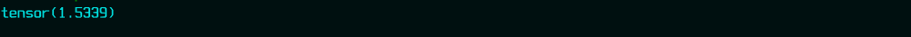
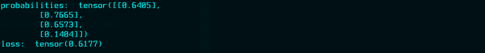
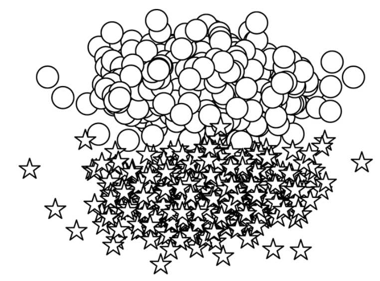
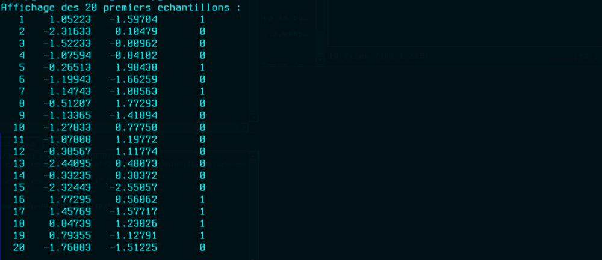
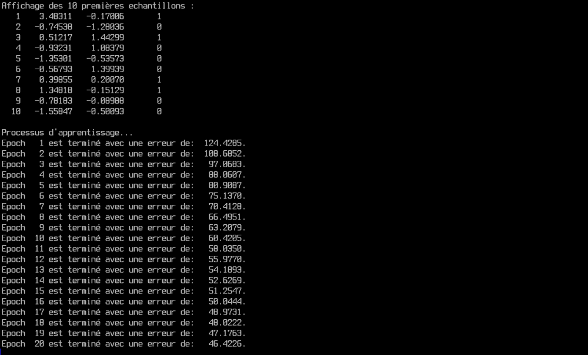
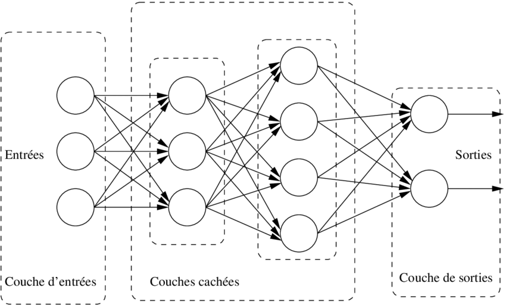

## Réseaux de neuronnes


Ce chapitre prépare le terrain pour les chapitres suivants en présentant
les idées de base de la construction des réseaux neuronaux, tels que les
fonctions d'activation, les fonctions de perte, les optimiseurs et la
configuration des alogorithmes d'apprentissage supervisée. On va commencer par
le perceptron qui représente un neurone, afin de relier les différents
concepts. Il s'agit d'un modèle commun qui sera utilisé tout au long du cour.


<br/>
<details id="table-content" open>
    <summary>Table des Contenus</summary>
    <ul>
        <li><a href="#le-perceptron">Le perceptron</a></li>
        <li><a href="#fonction-dactivation">Fonction d'activation</a>
            <ul>
                <li><a href="#signoid">Signoid</a></li>
                <li><a href="#tangent-hyperbolique">Tangent hyperbolique</a></li>
                <li><a href="#softmax">Softmax</a></li>
            </ul>
        </li>
        <li><a href="#fonction-de-perte">Fonction de perte</a>
            <ul>
                <li><a href="#mean-squared-error-loss">Mean Squared Error Loss</a></li>
                <li><a href="#categorical-cross-entropy-loss">Categorical Cross-Entropy Loss</a></li>
                <li><a href="#binary-cross-entropy-loss">Binary Cross-Entropy Loss</a></li>
            </ul>
        </li>
        <li><a href="#apprentissage-supervis%C3%A9e">Apprentissage supervisée</a>
            <ul>
                <li><a href="#construction-des-données">Construction des données</a></li>
                <li><a href="#choix-du-modèle">Choix du modèle</a></li>
                <li><a href="#choix-de-la-fonction-perte">Choix de la fonction perte</a></li>
                <li><a href="#choix-de-optimiseur">Choix de optimiseur</a></li>
                <li><a href="#programme-dapprentissage">Programme d'apprentissage</a></li>
            </ul>
        </li>
        <li><a href="#perceptron-multicouche">Perceptron multicouche</a></li>
        <!--<li><a href=""></a></li>-->
    </ul>
</details>

<div align="center">

[:house: **Retour à l'accueil**](../README.md)

</div>


### Le perceptron
Il est l'unité de réseaux neuronal le plus simple qui a été inspiré du neurone
biologique. Comme dans le cas d'un neurone biologique, il y a une entrée, une
sortie, et des "signaux" qui circulent des entrées vers les sorties, comme
l'illustre la figure suivante :


<div align="center">

###### Figure 01


</div>
<p align="center">
<i>
<ins>Figure 01</ins> : Schema illustrant la structure de calcul
d'un perceptron.
</i>
</p>

Chaque unité de perceptron possède une entrée $x$, une sortie $y$ et trois (3)
"boutons". Ces trois boutons dont je parle sont des opérations effectuées en
interne par le perceptron comme :
- le calcul de la somme pondérée du poids $w$ avec les entrées $x$;
- l'augmentation résultat cette somme pondérée avec biais $b$;
- et le calcul de la sortie $y$ avec une fonction d'activation $f$.

Ce sont les poids et le biais sont modifiés au fur et à mesure qu'on parcour
les données d'apprentissage. La fonction d'activation est choisie à la main en
fonction du problème à résoudre et du type de sortie qu'on veut avoir.
Mathématiquement, voici l'expression générale d'un perceptron :

$$
y = f(wx + b)
$$

Il arrive souvent que le perceptron reçoive plus d'une entrée. Pour cela, $x$
est généralement un vecteur ou une matrice ou ... de valeurs. $w$ pouvant aussi
être un vecteur ou une matrice de valeur, alors, le calcul $wx$ est
généralement un produit vectoriel ou matriciel.

La fonction d'activation, désignée ici par $f$, est généralement une fonction
non linéaire. Une fonction linéaire est une fonction dont la représentation
graphique est une ligne droite. $wx + b$ est une fonction linéaire. Par
conséquent, un perceptron est une fonction composée d'une fonction linéaire et
d'une fonction non linéaire. L'expression linéaire $wx + b$ est également
connue sous le nom de **transformation affine**.

Le code source suivant présente une implémentation de perceptron dans PyTorch
qui prend un nombre arbitraire d'entrées, effectue une transformation affine,
applique une fonction d'activation et produit une seule sortie.

###### `PYTHON [01]`
```python
# Importation des dépendances néccessaires :
import torch
import torch.nn as nn


class Perceptron(nn.Module):
    """Modèle d'un perceptron.

    :param: input_dim: Le nombre d'entrée du perceptron.
    :type: int
    """

    def __init__(self, input_dim):
        """Constructeur d'un modèle de perceptron.
        """
        super(Perceptron, self).__init__()

        # Un perceptron est constitué d'une couche
        # linéaire à une unitée.
        self.fc1 = nn.Linear(input_dim, 1)

    def forward(self, x):
        """Fonction de calcul de sortie d'un perceptron.

        :param: x: La valeur de données.
        :type: tensor.Tensor

        :return: La sortie y
        :rtype: torch.Tensor
        """
        z = self.fc1(x)  # Sortie linéaire.
        y = torch.sigmoid(z).squeeze()  # Sortie non linéaire.
        return y

```

La fonction d'activation utilisée dans ce exemple est la fonction sigmoïde.
On va maintenant explorer quelques fonctions d'activation courantes, comme
celle-ci.


### Fonction d'activation
Les fonctions d'activation sont des fonctions non-linéaires introduites dans
un réseau neuronal pour capturer des relations complexes dans les données.
Un peu plus bas dans ce chapitre, je vais te donner les raisons pour lesquelles
les non-linéarités sont nécessaires dans l'apprentissage.


#### Signoid
La sigmoïde est l'une des premières fonctions d'activation qui a été utilisée
dans l'histoire des réseaux de neurones. Il prend n'importe quelle valeur
réelle dans un intervalle de valeur comprises entre 0 et 1. Mathématiquement,
la fonction sigmoïde s'exprime comme suit :

$$
f(x) = \frac{1}{1 + e^{-x}}
$$

<!--Il est facile de voir à partir de l'expression que la sigmoïde est une
fonction lisse et différentiable.-->
La fonction `torch.sigmoid()` implémente la sigmoïde.

###### `PYTHON [02]`
```python
import torch
import matplotlib.pyplot as plt


# Application de la fonction sigmoïde
# sur une plage de valeur de x comprises
# entre -5.0 et 5.0 avec un pas de 0.1.
x = torch.range(-5.0, 5.0, 0.1)
y = torch.sigmoid(x)

# Représentation sur un graphique.
plt.plot(x.numpy(), y.numpy())
plt.show()

```

Comme tu peux le constater sur le graphique, la fonction sigmoïde sature
(c'est-à-dire qu'elle produit des sorties de valeur extrême) très rapidement
et le fait pour la majorité des entrées. Cela peut très vite poser un problème
dans le calcul des gradients.

<div align="center">

###### FIGURE 02


</div>
<p align="center">
<i>
<ins>Figure 02</ins> : Représentation graphique de la fonction sigmoïde.
</i>
</p>


#### Tangent hyperbolique
La fonction d'activation tanh est une variante de la sigmoïde, mais un peu
différente. Voici son expression mathématique.

$$
f(x) = tanh(x) = \frac{e^{x} - e^{-x}}{e^{x} + e^{-x}}
$$

Au fait, la fonction tangent hyperbolique est simplement une transformation
linéaire de la fonction sigmoïde. Ecrivons le code pour tracer sa courbe.

###### `PYTHON [03]`
```python
import torch
import matplotlib.pyplot as plt


# Application de la fonction sigmoïde
# sur une plage de valeur de x comprises
# entre -5.0 et 5.0 avec un pas de 0.1.
x = torch.range(-5.0, 5.0, 0.1)
y = torch.tanh(x)

# Représentation sur un graphique.
plt.plot(x.numpy(), y.numpy())
plt.grid()  # On affiche juste les grilles.
plt.show()

```

<div align="center">

###### FIGURE 03


</div>
<p align="center">
<i>
<ins>Figure 03</ins> : Représentation graphique
de la fonction tangente hyperbolique.
</i>
</p>

Remarquez que tanh, comme la sigmoïde, est également une fonction
"d'écrasement". Elle croit et décroit donc très vite aussi. L'ensemble
des valeurs réelles prises par cette fonction est $[-1; 1]$.


#### Softmax
Comme la fonction sigmoïde, la fonction softmax écrase la sortie de chaque
unité (neurone) pour qu'elle soit comprise entre 0 et 1, Cependant, l'opération
softmax divisent chaque sortie par la somme totale de toutes les
sorties. Ce qui nous donne une distribution de probabilité discrète sur k
classes possibles. Voici son expression mathématique :

$$
softmax(x_i) = \frac{e^{x_i}}{\sum_{j = 1}^{k} e^{x_j}}
$$

La somme de toute les probabilité est égale à 1. Ceci est très utile
pour l'interprétation des résultats des tâches de classification. Cette
transformation est donc généralement associée à un objectif
d'apprentissage probabiliste, tel que l'*entropie croisée catégorielle*, qu'on
verra bien sûre dans une prochaine section.

En attendant, voyons comment implémenter la fonction `softmax()` avec du code
python basique.

###### `PYTHON [04]`
```python
import math


def softmax(X):
    """Fonction de calcul softmax.

    :param: X: liste de nombre.
    :type X: list
    :returns: une liste de nombre.
    :rtype: list.
    """
    # On calcul la somme de tous les nombres.
    somme = sum([math.exp(x) for x in X])
    # On divise chaque nombre par la somme
    # calculée précédament.
    out = [0] * len(X)
    for i, x in enumerate(X):
        out[i] = math.exp(x) / somme
    return out

# Voici une liste de nombre.
X = [120, 340, 50, 230]

# on calcul le softmax :
y = softmax(X)
print(y)

```


Et oui ! Pas de panique. Tout est logique. Maintenant, voyons ce calcul avec
Pytorch.

###### `PYTHON [05]`
```python
import torch
import torch.nn as nn


# Initialisation de la fonction softmax
# pour le calcul des vecteurs de nombres.
softmax = nn.Softmax(dim=0)

X = [120, 340, 50, 230]
x_input = torch.tensor(X, dtype=torch.float64)
y_output = softmax(x_input)

print("Valeur de softmax avec torch :", y_output)
print("La somme de ses valeurs est :", torch.sum(y_output, dim=0))

```


Si tu compares bien les deux résultats des deux codes, tu peux déjà imaginer
que le code écrit à l'intérieur de la fonction `nn.Softmax()` de Pytorch est
le premier code.


### Fonction de perte
La fonction de perte prend la valeur vraie $y$ et la valeur prédicte $ŷ$ en
entrée et produit un nombre à valeur réelle. Plus ce nombre est élevé, plus
la prédiction du modèle est mauvaise. De nombreuse fonctions de perte sont
implémentées dans Pytorch. En voici quelque unes couramment utilisées.


#### Mean Squared Error Loss
S'il s'agit d'un problèmes de régression dont la sortie du réseau $ŷ$ et
la cible $y$ sont des valeurs continues, alors une fonction de perte courante
qu'on peut utiliser est l'erreur quadratique moyenne (**MSE**). Son expression
mathématique est :

$$
L_{MSE}(y, ŷ) = \frac{1}{n}\sum_{i = 1}^{n}(y - ŷ)^2
$$

Donc, L'MSE est simplement la moyenne des carrés de la différence entre les
valeurs prédites et les valeurs cibles ou vraie. Il existe plusieurs autres
fonctions de perte que tu peux utiliser pour les problèmes de régression,
telles que l'erreur absolue moyenne (MAE) et l'erreur quadratique moyenne
(RMSE), mais elles impliquent toutes le calcul d'une distance à valeur réelle
entre la valeur prédicte et la valeur vraie (cible).

On passe à l'implémentation de la fonction MSE en python :

###### `PYTHON [06]`
```python
def mse(preds, target):
    """Fonction de calcul de MSE.

    Erreur quadratique moyenne.

    :param preds: La liste des valeurs prédictes.
    :type preds: list

    :param target: La liste des valeurs cible (vraie).
    :type target: list

    :returns: L'erreur quadratique moyenne.
    :rtype: float
    """
    n = len(target)  # ou n = len(preds)
    s = sum([(preds[i] - target[i])**2 for i in range(n)])
    return s / n

# Exemple d'une liste de valeur prédictes:
yp = [0.97, 0.732, 2.9, 1.67]

# Exemple d'une liste de valeur cible:
y = [1.23, -2, 1.75, 0]

# On calcule et affiche l'erreur:
loss = mse(yp, y)
print("LOSS:", loss)

```


Maintenant passons à l'implémentation de cette même fonction en utilisant
Pytorch.

###### `PYTHON [07]`
```python
import torch
import torch.nn as nn


# On initialisation la fonction MSE.
mse_loss = nn.MSELoss()

yp = [0.97, 0.732, 2.9, 1.67]
y = [1.23, -2, 1.75, 0]

outputs_t = torch.tensor(yp, dtype=torch.float64)
targets_t = torch.tensor(y, dtype=torch.float64)

# On calcule et affiche l'erreur:
loss = mse_loss(outputs_t, targets_t)
print("LOSS:", loss)

```


Je pense que tu as tout compris à présent.


#### Categorical Cross-Entropy Loss
La fonction de perte d'entropie croisée catégorielle est généralement utilisée
dans des tâches de classification multiclasse dans lesquelles les résultats
sont interprétés comme des prédictions de probabilités d'appartenance à une
classe. La sortie $y$ du modèle est un vecteur à $n$ éléments qui représente
une distribution multinomiale sur toutes les classes (catégories).

> **Note** : Un vecteur de nombre peut être considéré comme une distribution
> si la somme de tous ses éléments (nombres) est égale à **1**.

Du coup, les sorties expérées, c'est à dire nos "target" seront aussi
transformés en vecteur de taille $n$, dont chaque élément représente la
probabilité d'appartenance à une catégorie de l'ensemble de données.
Si une ligne $(X_i, y_i)$ de notre dataset porte une seule classe, alors on
dira que la probabilité d'appartenance à cette classe est `1` (100%) et le
vecteur de sortie représentant son $y_i$ sera un vecteur "one-hot"
(`[0, 0, ..., 0, 1, 0, ..., 0, 0]`). L'index du `1` se trouvant dans ce dernier
est l'entier qui représente cette catégorie ou classe. L'entropie croisée
catégorielle va comparer ces deux vecteurs ($y$, $ŷ$) pour mesurer la perte.
Voici son expression :

$$
L_{cross\_entropy(y, ŷ)} = - \sum_{i = 1}^{n} y_i \times log(ŷ_i)
$$

> L'entropie croisée et son expression trouvent leur origine dans la théorie
> de l'information, mais pour les besoins de cette section, il est utile de la
> considérer comme une méthode permettant de calculer la différence entre deux
> distributions.
<!--
Passons maintenant à l'implémentation de cette fonction en langage Python
simple.

```python
import math


def categorical_cross_entropy(preds, targets):
    """Fonction de calcule de perte d'entropie croisée catégorielle.

    :param preds: La distribution de probabilité prédite.
    :type preds: list
    :param targets: La distribution de probabilité attendue.
    :type targets: list

    :returns: La perte calculée.
    :rtype: float
    """
    epsilon = 1e-31
    # epsilon sera utilisé pour éviter d'avoir un log(0) durant le calcul.
    # Car le domaine de définition de la fonction logarithmique est ]0; +inf[.
    # Et c'est pour qu'il n'y ait pas d'effets sur le calcul qu'il faut
    # prendre une valeur très petite.

    err_sum = 0.0
    for y_i, yi in zip(preds, targets):
        y_i = -1 * y_i if y_i < 0 else y_i
        err_sum += yi * math.log(y_i + epsilon)

    return err_sum


# Soit y les sorties expérées:
y = [[0, 1, 0, 0, 0],
     [1, 0, 0, 0, 0],
     [0, 0, 0, 1, 0]]

# Soit yp les sorties prédictes:
yp = [[-0.0922,  0.8214,  0.3349,  0.4971, -1.0460],
      [ 2.8914, -0.0815,  0.6760,  0.5392, -0.8550],
      [ 1.2244,  0.4889, -0.7127, -1.4901, -1.1385]]


losses = 0.0  # L'erreur totale commise

# Etant donné qu'on a plusieurs lignes, on va procéder
# par itération et afficher la totale à la fin.
for yp_row, y_row in zip(yp, y):
    loss = categorical_cross_entropy(yp_row, y_row)
    losses += loss
    print(f"* loss: {loss:.5f}")

print(f"TOTAL LOSS: {losses:.4f}")

```
-->
Maintenant, on passe à la programmation de la fonction de perte en utilisant
Pytorch.

###### `PYTHON [08]`
```python
import torch
import torch.nn as nn


ce_loss = nn.CrossEntropyLoss()
outputs = torch.tensor(
    [[-0.0922,  0.8214,  0.3349,  0.4971, -1.0460],
     [ 2.8914, -0.0815,  0.6760,  0.5392, -0.8550],
     [ 1.2244,  0.4889, -0.7127, -1.4901, -1.1385]]
)

# L'implémentation de CrossEntropyLoss() de PyTorch suppose
# que chaque entrée a une classe particulière, et que chaque
# classe a un index unique.
targets = torch.tensor([1, 0, 3], dtype=torch.int64)
loss = ce_loss(outputs, targets)
print(loss)

```




#### Binary Cross-Entropy Loss
La fonction de perte d'entropie croisée catégorielle que nous avons vue dans
la section précédente est très utile dans les problèmes de classification
lorsque nous avons plusieurs classes. Mais, parfois, notre tâche consiste à
discriminer entre deux classes (classification binaire). Dans ce cas, il est
efficace d'utiliser la fonction de perte d'entropie croisée binaire (BCE).
On utilisera cette fonction dans l'exemple de classification de l'ensemble
des critiques de restaurants.

###### `PYTHON [09]`
```python
import torch
import torch.nn as nn


bce_loss = nn.BCELoss()  # Instanciation de la fonctions d'erreur.
sigmoid = nn.Sigmoid()  # Instanciation de la fonction sigmoid.

# On definit un semblant de valeur représentant
# les sorties successives d'un modèle.
output = torch.tensor(
    [[ 0.5777],
     [ 1.1885],
     [ 0.6515],
     [-1.8122]]
)  # shape: (4, 1)

# On les convertie tous en distribution de probabilités
probabilities = sigmoid(output)

# Les sorties attendues.
targets = torch.tensor([1, 0, 1, 0], dtype=torch.float32)  # shape: (1, 4)
targets = targets.view(4, 1)  # shape: (4, 1)

# Calcul de l'erreur.
loss = bce_loss(probabilities, targets)

print("probabilities: ", probabilities)
print("loss: ", loss)

```




### Apprentissage supervisée
L'apprentissage supervisée nécessite les éléments suivants : un modèle,
une fonction de perte, des données d'apprentissage et un algorithme
d'optimisation. Les données d'apprentissage pour l'apprentissage supervisée
sont des paires d'observations et d'étiquettes (cibles). le modèle calcule les
prédictions à partir des observations, et la fonction de perte mesure l'erreur
des prédictions par rapport aux valeurs attendues (ou cibles). L'objectif de
l'apprentissage est d'utiliser l'algorithme d'optimisation basé sur le calcul
de gradient pour ajuster les paramètres du modèle afin que les pertes
deviennent aussi petites que possible.

Dans cette section, on va résoudre un problème classique de classification
qui consiste à classer des points bidimensionnels (2-dimensions) dans l'une
des deux classes. Intuitivement, il s'agit d'apprendre une ligne (droite)
unique, appelée *frontière de décision* ou *hyperplan*, pour distinguer les
points d'une classe de l'autre. Je vais te décrire la construction des données,
le choix du modèle, la sélection d'une fonction de perte, la mise en place de
l'algorithme d'optimisation, et, enfin, l'exécution de l'ensemble.


#### Construction des données
Dans cette section, on va utiliser des données synthétiques pour la tâche de
classification des points à deux dimensions dans l'une des deux classes.
Pour construire ces données, on va échantillonner les points en deux parties
différentes du plan $xy$, créant ainsi une situation facile à apprendre pour
le modèle.

<div align="center">

###### FIGURE 04



</div>
<p align="center">
<i>
<ins>Figure 04</ins> : Construction d'un jeu de données linéairement séparable.
</i>
</p>

> **Note** : les **données synthétiques** sont des données générées
> artificiellement et non générées par des événements réels.


Les deux classes dont les étoiles (⋆) et les les cercles (◯). Voici le code
source pour générer de telles données :

###### `PYTHON [10]`
```python
from sklearn.datasets import make_classification

# On crée les observations (features) et les cibles (targets)
features, targets = make_classification(
    n_samples=100,  # On crée 100 échantions (100 lignes)
    n_features=2,  # Chaque élément a deux caractéristiques (deux variables)
    n_redundant=0, # 0 pour indiquer qu'il aura pas de répétition de données.
    n_classes=2,  # Indique le nombre de classe, ici 2 classes.
    random_state=45, # Juste une graine pour le générateur aléatoire.
)

n = 20
print(f"Affichage des {n} premières echantillons :")
for i, x, y in zip(range(n), features[:n], targets[:n]):
    print(f"{i+1:4d} {x[0]:10.5f} {x[1]:10.5f} \t {y:1d}")

```




#### Choix du modèle
Le modèle que nous allons utiliser ici est celui que t'es présenté au début du
chapitre : le perceptron. Dans une situation de modélisation typique, la nombre
d'entrées est déterminée par la tâche à accomplir et les données à traiter.
Dans cet exemple, la nombre d'entrée est de 2 car on a explicitement construit
les données dans un plan à deux dimensions. Pour ce problème à deux classes,
on attribut un indice numérique aux classes : `0` et `1`.  La correspondance
entre les étiquettes ⋆ et ◯ et les indices de classe `0` et `1`
est arbitraire, c'est à dire que tu peux dire que pour toi l'étiquettes ⋆
corresponds à l'indice `1` et étiquettes ◯ corresponds à l'indice `0`, ou 
l'inverse. Cela ne change absolument rien concernant le bon déroulement de
l'exécution de la tâche. Pourvue qu'il y ait une cohérance tout au long du
prétraitement des données, de l'apprentissage, de l'évaluation et des tests.

Une propriété supplémentaire importante de ce modèle est la nature
de sa sortie. La fonction d'activation du perceptron étant une sigmoïde, alors
la sortie du perceptron est sera interpreter comme une probabilité qu'un point
de données (x) apartienne à l'une ou l'autre des deux classes. Cela se note
$P(y = 1|x)$ pour la classe `1` et $P(y = 0|x)$ pour la classe `0`.

Pour les problèmes de classification binaire, on peut convertir la
probabilité obtenue en sortie en deux classes discrètes en se donnant une
limite de décision $δ$. Si la probabilité prédicte est $P(y = 1|x) > δ$, alors
la classe prédicte est `1`, dans la cas contraire ($P(y = 1|x) \leq δ$),
la classe prédicte est `0`. La plus part du temps on fixe δ à `0.5`, mais
dans la pratique, il peut arriver qu'on règle cet hyperparamètre en fonction
des résultats d'évaluation du modèle afin d'obtenir la précision souhaitée
dans une tâche de classification.


#### Choix de la fonction perte
Après avoir préparé les données et sélectionné une architecture de modèle,
tu dois choisir deux autres composants qui sont essentiels dans le cadre de
l'apprentissage supervisée : une fonction de perte et un optimiseur.
Pour les situations dans lesquelles la sortie du modèle est une probabilité,
la famille de fonctions de perte la plus appropriée est celle des pertes
basées sur l'entropie croisée. Pour cet exemple de jeu de données, et étant
donné que le modèle produit des résultats binaires, on va spécifiquement
utiliser la fonction de perte *Binary cross entropy* (BCE).


#### Choix de optimiseur
Le dernier choix à faire dans cet exemple simplifié d'apprentissage supervisée
est l'optimiseur. Pendant que le modèle effectue des prédictions et que la
fonction de perte mesure l'erreur entre les prédictions et les cibles,
l'optimiseur met à jour les paramètres (poids) du modèle de façon à minimiser
les erreurs de prédiction. Ce optimiseur est paramétré par le *taux
d'apprentissage*. Ce taux est un hyperparamètre qui a un effet sur la mise
à jour des paramètres du modèle. Du coup, la variation de ce taux a
une conséquence sur la précision du modèle après son apprentissage.

Un taux d'apprentissage élevé entraine des modifications plus importantes
des paramètres et peuvent affecter la convergence du modèle. Inversement,
un taux d'apprentissage trop faible peut diminuer la vitesse d'apprentissage
du modèle. Dans ce cas de figure, on dira que le modèle converge lantement.

> **Note** : on dit qu'un modèle converge, lorsque son erreur de prédiction diminue
> considérablement. Ce qui est une bonne chose ! :blush:

La bibliothèque PyTorch propose plusieurs choix d'optimiseurs. Parmit eux,
on a :
- Stochastic gradient descent (SGD);
- Optimiseur Adagrad;
- Optimiseur Adam;
- etc.

La descente stochastique du gradient (SGD) est un algorithme classique, mais
pour les problèmes d'optimisation difficiles, cet algorithme d'optimisation
cause des problèmes de convergence au niveau du modèle. L'alternative
actuellement préférée est celle des optimiseurs adaptatifs, tels que Adagrad
ou Adam. Ils utilisent des informations sur les mises à jour dans le temps.
Dans notre exemple de classification, on va utiliser l'optimiseur Adam, mais
il est toujours utile d'essayer plusieurs optimiseurs. Avec Adam, le taux
d'apprentissage par défaut est `0.001`. Avec des hyperparamètres comme le taux
d'apprentissage, il est toujours recommandé d'utiliser d'abord les valeurs par
défaut, à moins que tu dispose d'une recette tirée d'un article exigeant une
valeur spécifique.

###### `</> PYTHON [11]`
```python
import torch
import torch.nn as nn
import torch.optim as optim


class Perceptron(nn.Module):
    """Modèle d'un perceptron.

    :param: input_dim: Le nombre d'entrée du perceptron.
    :type: int
    """

    def __init__(self, input_dim):
        """Constructeur d'un modèle de perceptron.
        """
        super(Perceptron, self).__init__()

        # Un perceptron est constitué d'une couche
        # linéaire à une unitée.
        self.fc1 = nn.Linear(input_dim, 1)

    def forward(self, x):
        """Fonction de calcul de sortie d'un perceptron.

        :param: x: La valeur de données.
        :type: tensor.Tensor

        :return: La sortie y
        :rtype: torch.Tensor
        """
        z = self.fc1(x)  # Sortie linéaire.
        y = torch.sigmoid(z).squeeze()  # Sortie non linéaire.
        return y


input_dim = 2  # Le nombre de variables d'entrées du modèle.
lr = 0.001  # Le taux d'apprentissage

model = Perceptron(input_dim=input_dim)  # Notre Modèle.
bce_loss = nn.BCELoss()  # Notre fonction de perte.
optimizer = optim.Adam(params=model.parameters(), lr=lr)  # Notre optimiseur.

```


#### Programme d'apprentissage
L'apprentissage commence par le calcul de l'erreur ou perte, c'est-à-dire :
la mesure de l'écart entre les prédictions du modèle et la valeur vraie
(cible). Le gradient de la fonction de perte, à son tour, représente une valeur
indiquant de "combien" les paramètres doivent augmenter ou diminuer. Tout ce
qui est impliqué dans l'apprentissage d'un modèle basé sur le calcul de
gradient est la mise à jour itérative de chaque paramètre avec le gradient
de la fonction de perte calculé par rapport à ce paramètre.

$$
w = w - \alpha \times \frac{\partial E}{\partial w}
$$

Voici la formule de mise à de paramètre avec le gradient. **$w$** représentant
un paramètre; **$\alpha$** le taux d'apprentissage (`lr`); **$E$** la fonction
de calcul d'erreur et **$\frac{\partial E}{\partial w}$** la dérivée partielle
de la fonction $E$ par rapport à $w$. C'est cette dérivée qui représente un
composant du gradient.

Voyons un peu comment cela se présente avec Pytorch. Tout d'abord, toutes les
données modifiables, telles que les paramètres du modèle, etc, sont
initialisées. Les gradients aussi actuellement stockées dans l'objet du modèle
(perceptron) sont initialisées à l'aide d'une fonction appelée `zero_grad()`.
Au cour de l'apprentissage, le modèle calcule les sorties (`y_pred`) en
fonction des données d'entrée (`x_data`). Ensuite, l'erreur est calculée en
comparant les sorties du modèle (`y_pred`) aux cibles prévues (`y_target`). Il
s'agit bien de la partie supervisée de l'apprentissage. L'objet de perte
PyTorch (`criterion`) généré après calcul de l'erreur, possède une fonction
appelée `backward()`. Cette fonction propage itérativement la perte vers
l'arrière à travers le graphe de calcul en calculant les différentes dérivées
partielles par rapport à chaque paramètre. Enfin, à l'aide de la fonction
`step()`, l'optimiseur (`opt`) met à jour les paramètres en utilisant la valeur
de leur dérivée respective, exactement comme dans la formule mathématique
précédente.

L'ensemble des données de d'apprentissage est divisé en plusieurs lots. Chaque
lot de données a une taille définie par l'hyperparamètre d'apprentissage
nommé `batch_size`. L'ensemble de données d'apprentissage étant fixe, alors
l'augmentation de la taille des lots (`batch_size`) diminue le nombre de lots.
La mise à des paramètres du modèle se fait après chaque lot de données.
Il appèle ça souvent *descente par batch*.

Après avoir parcouru tous les lots de l'ensemble de données de taille finie,
alors on dit que la boucle d'apprentissage a terminé une époque. Une époque
est une itération d'apprentissage complète. Les modèles sont appris pendant un
certain nombre d'époques (itérations). Le nombre d'époques d'apprentissage
n'est pas facile à choisir, mais il existe des méthodes permettant de
déterminer le moment où il faut s'arrêter. On les verra plus tard.

###### `</> PYTHON [12]`
```python
import numpy as np
from sklearn.datasets import make_classification

import torch
import torch.nn as nn
import torch.optim as optim


INPUT_DIM = 2
N_CLASSES = 2

BATCH_SIZE = 50
EPOCHS = 20
LEARNING_RATE = 0.001


class Perceptron(nn.Module):
    """Modèle d'un perceptron.

    :param: input_dim: Le nombre d'entrée du perceptron.
    :type: int
    """

    def __init__(self, input_dim):
        """Constructeur d'un modèle de perceptron.
        """
        super(Perceptron, self).__init__()

        # Un perceptron est constitué d'une couche
        # linéaire à une unitée.
        self.fc1 = nn.Linear(input_dim, 1)

    def forward(self, x):
        """Fonction de calcul de sortie d'un perceptron.

        :param: x: La valeur de données.
        :type: tensor.Tensor

        :return: La sortie y
        :rtype: torch.Tensor
        """
        z = self.fc1(x)  # Sortie linéaire.
        y = torch.sigmoid(z).squeeze()  # Sortie non linéaire.
        return y


def load_dataset(n_samples, input_dim, n_classes): 
    # On crée les observations (features) et les cibles (targets)
    features, targets = make_classification(
        n_samples=n_samples,
        n_features=input_dim,
        n_redundant=0,
        n_classes=n_classes,
        random_state=45,
    )
    return features, targets


def print_n_first(features, targets, n = 10):
    print(f"Affichage des {n} premières echantillons :")
    for i, x, y in zip(range(n), features[:n], targets[:n]):
        print(f"{i+1:4d} {x[0]:10.5f} {x[1]:10.5f} \t {y:1d}")


def batch2tensor(x_arr, y_arr, dtype=torch.float):
    # On converti les tableau en tableau numpy pour éviter
    # d'avoir l'avertissement suivant:
    #
    # `UserWarning: Creating a tensor from a list of numpy.ndarrays
    # is extremely slow. Please consider converting the list to a
    # single numpy.ndarray with numpy.array() before converting to a
    # tensor...``
    x_arr = np.array(x_arr)
    y_arr = np.array(y_arr)
    return (
        torch.tensor(x_arr, dtype=dtype),
        torch.tensor(y_arr, dtype=dtype),
    )


def get_batch_generator(features, targets):
    n_samples = len(features)
    x_batch = []
    y_batch = []
    for i in range(n_samples):
        x_batch.append(features[i])
        y_batch.append(targets[i])

        if len(x_batch) >= BATCH_SIZE:
            yield batch2tensor(x_batch, y_batch)
            x_batch.clear()
            y_batch.clear()

    if x_batch:
        # Si ça reste encore, alors on balance le reste
        # dans un dernier lot.
        yield batch2tensor(x_batch, y_batch)


def main():
    """Fonction principale"""
    # On charge la dataset:
    X, y = load_dataset(10000, INPUT_DIM, N_CLASSES)
    print_n_first(X, y, n=10)

    # Onn initialise le modèle et ses composants:
    perceptron = Perceptron(input_dim=INPUT_DIM)  # Notre Modèle.
    bce_loss = nn.BCELoss()
    optimizer = optim.Adam(params=perceptron.parameters(), lr=LEARNING_RATE)

    print("\nProcessus d'apprentissage...")
    for epoch in range(EPOCHS):
        batchs = get_batch_generator(X, y)
        losses = 0
        for x_data, y_target in batchs:
            # On efface les gradients:
            perceptron.zero_grad()
            # On calcule une novelle prédiction:
            y_pred = perceptron(x_data)
            # Calcul de l'erreur:
            loss = bce_loss(y_pred, y_target)
            losses += loss.item()
            # Propagation vers l'arrière: Calcule des gradients
            loss.backward()
            # Mise à jour des paramètres du modèle:
            optimizer.step()

        print(
            f"Epoch {(epoch + 1):3d} est terminé"
            f" avec une erreur de: {losses:9.4f}."
        )


if __name__ == '__main__':
    # Exécution principale:
    main()

```



Et voilà ! Tu remarques bien que l'erreur diminue au fur à mesure qu'il
évolue dans les itérations, donc notre modèle apprend ou converge.


### Concepts de l'apprentissage auxiliaire
L'idée de base de l'apprentissage supervisé basé sur le gradient est simple :
définir un modèle, calculer les sorties, utiliser une fonction de perte pour
calculer les gradients et appliquer un algorithme d'optimisation pour mettre
à jour les paramètres du modèle avec les gradients respectifs. Cependant,
il existes plusieurs concepts auxiliaires pour le processus d'apprentissage.
On va explorer quelques-uns dans cette section.


#### Mesure des performances
Le composant le plus important en dehors de la boucle principale
d'apprentissage supervisée est une mesure objective de la performance
en utilisant de données sur lesquelles le modèle n'a jamais été entrainé.
Les modèles sont évalués à l'aide d'une ou plusieurs mesures de performance.
Une des plus courante est la **précision**. La précision est simplement le
rapport entre le nombre de prédictions correctes et le nombre total de données
présentes dans l'ensemble de données qui n'a pas été utilisé pour
l'entrainement.

Il est important de toujours garder à l'esprit que l'objectif final est de
bien généraliser la vraie valeur des données dans le modèle. C'est vrai que
dans la vie réelle, il peut exister une infinité de données et si on veut
vraiment généraliser le phénomène à l'origne de ces données, il va falloire
avoir la total. Mais, au lieu de ça, on se content d'un échantillon que
nous appelons "données d'apprentissage". On dit q'un modèle s'est mieux
généralisé qu'un autre modèle s'il commet non seulement moins d'erreur sur
les échantillons de données étudiées au cour de l'apprentissage, mais aussi sur
les échantillons non étudiés. Cepandant, lorsque le modèle s'efforce
de réduire ses erreurs sur les données d'apprentissage, il peut se "suradapter"
et s'adapter à des particularités qui ne font pas réellement partie de la
véritable distribution des données. On qualifie ce phénomène d'**Overfitting**.

> Et Maintenant, c'est bon, ou ce n'est pas bon ? :thinking:

Ce n'est pas bon, car même si c'est une bonne chose de constater que le
modèle s'efforce à réduire ses erreurs de prédictions, cela devient très
vite un gros problème.

Pour éviter ce genre de problème et atteindre une bonne précision de
prédiction, la bonne pratique courante consiste à diviser l'ensemble de
données en trois partitions générées de manière aléatoire qui sont :
- ensembles de données d'apprentissage,
- ensembles de données de validation,
- ensembles de données de test.

Ou bien, procéder à une **validation croisée kfold**.


### Perceptron multicouche
Le perceptron multicouche est l'un des éléments de base des réseaux neuronaux.
Dans le perceptron simple, il s'agit d'un seul neurone qui prend un vecteur
de nombres en entrée et calcule une seule valeur (un scalaire) en sortie.
Dans un perceptron multicouche (MLP), on dispose de plusieurs couches placées
l'une après l'autre, et chacune de ces couches regroupe plusieurs perceptrons
de sorte qu'on ait un vecteur de nombres en sortie. De plus, dans un MLP,
le vecteur de nombres produits en sortie d'une couche est envoyé en entré à la
couche suivante, jusqu'à atteindre la dernière couche.

Dans PyTorch, cela se fait tout simplement en alignant des `nn.Linear(n, p)`
et en changeant les valeurs `n` et `p`. Par exemple :

###### `</> PYTHON [13]`
```python
import torch.nn as nn

# ...

# Premières couche à 3 entrées et 3 sorties:
first = nn.Linear(3, 3)

# Deuxièmes couche à 3 entrées et 4 sorties:
second = nn.Linear(3, 4)

# Dernière couche à 4 entrés et 2 sorties:
last = nn.Linear(4, 2)

```

<div align="center">

###### FIGURE 05



</div>
<p align="center">
<i>
<ins>Figure 05</ins> : Résultat schématique du perceptron du code ci-dessus.

</i>
</p>

Comme tu peux déjà le remarquer, le nombre de sorties d'une couche est égale
au nombre de neurones présents sur cette couche. Et ensuite, le nombre
d'entrées d'un couche $c_i$ est égale au nombre de neurones présents sur la
couche immédiatement précédente $c_{i-1}$.


<br/>
<br/>
<div align="center">

[:arrow_backward: Introduction au Tenseur](../tensor/README.md)
<!-- | [**Exemples de projet :arrow_forward:**](../examples/README.md) -->

</div>
