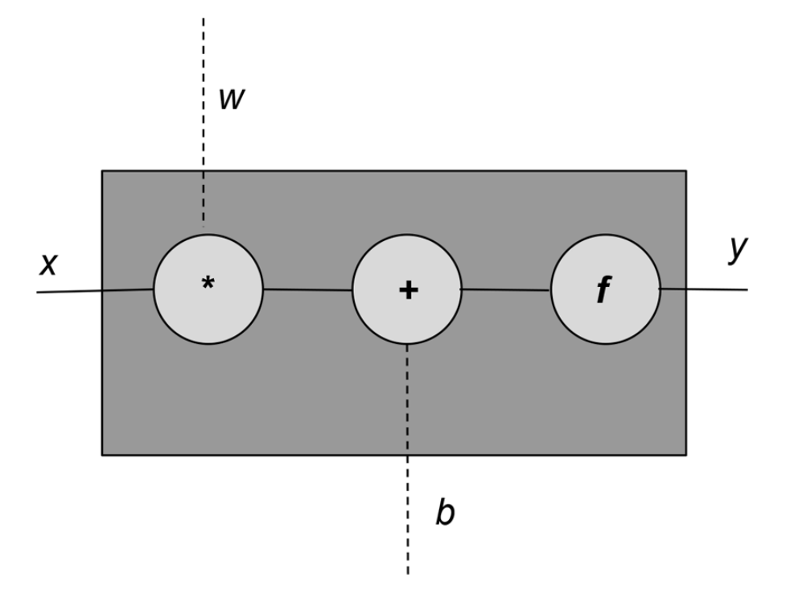

## Réseaux de neuronnes


Ce chapitre prépare le terrain pour les chapitres suivants en présentant
les idées de base de la construction des réseaux neuronaux, tels que les
fonctions d'activation, les fonctions de perte, les optimiseurs et la
configuration des alogorithmes d'apprentissage supervisée. On va commencer par
le perceptron qui représente un neurone, afin de relier les différents
concepts. Il s'agit d'un modèle commun qui sera utilisé tout au long du cour.


<details id="table-content" open>
    <summary>Table des Contenus</summary>
    <ul>
    </ul>

</details>
<br/>


### Le perceptron
Il est l'unité de réseaux neuronal le plus simple qui a été inspiré du neurone
biologique. Comme dans le cas d'un neurone biologique, il y a une entrée, une
sortie, et des "signaux" qui circulent des entrées vers les sorties, comme
l'illustre la figure suivante :


<div align="center">



</div>
<p align="center">
<ins>Figure 01</ins> : Schema illustrant la structure de calcul
d'un perceptron.
</p>

Chaque unité de perceptron possède une entrée $x$, une sortie $y$ et trois (3)
"boutons". Ces trois boutons dont je parle sont des opérations effectuées en
interne par le perceptron comme :
- le calcul de la somme pondérée du poids $w$ avec les entrées $x$;
- l'augmentation résultat cette somme pondérée avec biais $b$;
- et le calcul de la sortie $y$ avec une fonction d'activation $f$.

Ce sont les poids et le biais sont modifiés au fur et à mesure qu'on parcour
les données d'apprentissage. La fonction d'activation est choisie à la main en
fonction du problème à résoudre et du type de sortie qu'on veut avoir.
Mathématiquement, voici l'expression générale d'un perceptron :

$$
y = f(wx + b)
$$

Il arrive souvent que le perceptron reçoive plus d'une entrée. Pour cela, $x$
est généralement un vecteur ou une matrice ou ... de valeurs. $w$ pouvant aussi
être un vecteur ou une matrice de valeur, alors, le calcul $wx$ est
généralement un produit vectoriel ou matriciel.

La fonction d'activation, désignée ici par $f$, est généralement une fonction
non linéaire. Une fonction linéaire est une fonction dont la représentation
graphique est une ligne droite. $wx + b$ est une fonction linéaire. Par
conséquent, un perceptron est une fonction composée d'une fonction linéaire et
d'une fonction non linéaire. L'expression linéaire $wx + b$ est également
connue sous le nom de **transformation affine**.

Le code source suivant présente une implémentation de perceptron dans PyTorch
qui prend un nombre arbitraire d'entrées, effectue une transformation affine,
applique une fonction d'activation et produit une seule sortie.

```python
# Importation des dépendances néccessaires :
import torch
import torch.nn as nn


class Perceptron(nn.Module):
    """Modèle d'un perceptron.

    :param: input_dim: Le nombre d'entrée du perceptron.
    :type: int
    """

    def __init__(self, input_dim):
        """Constructeur d'un modèle de perceptron.
        """
        super(Perceptron, self).__init__()

        # Un perceptron est constitué d'une couche
        # linéaire à une unitée.
        self.fc1 = nn.Linear(input_dim, 1)

    def forward(self, x):
        """Fonction de calcul de sortie d'un perceptron.

        :param: x: La valeur de données.
        :type: tensor.Tensor

        :return: La sortie y
        :rtype: torch.Tensor
        """
        z = self.fc1(x)  # Sortie linéaire.
        y = torch.sigmoid(z).squeeze()  # Sortie non linéaire.
        return y

```

La fonction d'activation utilisée dans ce exemple est la fonction sigmoïde.
On va maintenant explorer quelques fonctions d'activation courantes, comme
celle-ci.


### Fonction d'activation
Les fonctions d'activation sont des fonctions non-linéaires introduites dans
un réseau neuronal pour capturer des relations complexes dans les données.
Un peu plus bas dans ce chapitre, je vais te donner les raisons pour lesquelles
les non-linéarités sont nécessaires dans l'apprentissage.


#### Signoid
La sigmoïde est l'une des premières fonctions d'activation qui a été utilisée
dans l'histoire des réseaux de neurones. Il prend n'importe quelle valeur
réelle dans un intervalle de valeur comprises entre 0 et 1. Mathématiquement,
la fonction sigmoïde s'exprime comme suit :

$$
f(x) = \frac{1}{1 + e^{-x}}
$$

<!--Il est facile de voir à partir de l'expression que la sigmoïde est une
fonction lisse et différentiable.-->
La fonction `torch.sigmoid()` implémente la sigmoïde.

```python
import torch
import matplotlib.pyplot as plt


# Application de la fonction sigmoïde
# sur une plage de valeur de x comprises
# entre -5.0 et 5.0 avec un pas de 0.1.
x = torch.range(-5.0, 5.0, 0.1)
y = torch.sigmoid(x)

# Représentation sur un graphique.
plt.plot(x.numpy(), y.numpy())
plt.show()

```

Comme tu peux le constater sur le graphique, la fonction sigmoïde sature
(c'est-à-dire qu'elle produit des sorties de valeur extrême) très rapidement
et le fait pour la majorité des entrées. Cela peut très vite poser un problème
dans le calcul des gradients.

<div align="center">


</div>
<p align="center">
<ins>Figure 02</ins> : Représentation graphique de la fonction sigmoïde.
</p>


#### Tangent hyperbolique
La fonction d'activation tanh est une variante de la sigmoïde, mais un peu
différente. Voici son expression mathématique.

$$
f(x) = tanh(x) = \frac{e^{x} - e^{-x}}{e^{x} + e^{-x}}
$$

Au fait, la fonction tangent hyperbolique est simplement une transformation
linéaire de la fonction sigmoïde. Ecrivons le code pour tracer sa courbe.

```python
import torch
import matplotlib.pyplot as plt


# Application de la fonction sigmoïde
# sur une plage de valeur de x comprises
# entre -5.0 et 5.0 avec un pas de 0.1.
x = torch.range(-5.0, 5.0, 0.1)
y = torch.tanh(x)

# Représentation sur un graphique.
plt.plot(x.numpy(), y.numpy())
plt.grid()  # On affiche juste les grilles.
plt.show()

```

<div align="center">


</div>
<p align="center">
<ins>Figure 03</ins> : Représentation graphique
de la fonction tangente hyperbolique.
</p>

Remarquez que tanh, comme la sigmoïde, est également une fonction
"d'écrasement". Elle croit et décroit donc très vite aussi. L'ensemble
des valeurs réelles prises par cette fonction est $[-1; 1]$.


#### Softmax
Comme la fonction sigmoïde, la fonction softmax écrase la sortie de chaque
unité (neurone) pour qu'elle soit comprise entre 0 et 1, Cependant, l'opération
softmax divisant chaque sortie par la somme totale de toutes les
sorties. ce qui nous donne une distribution de probabilité discrète sur k
classes possibles. Voici son expression mathématique :

$$
softmax(x_i) = \frac{e^{x_i}}{\sum_{j = 1}^{k}{e^{x_j}}}
$$

La somme de toute les probabilité sont toutes égale à 1. Ceci est très utile
pour l'interprétation des résultats des tâches de classification. Cette
transformation est donc généralement associée à un objectif
d'apprentissage probabiliste, tel que l'*entropie croisée catégorielle*, qu'on
verra biensûre dans une prochaine section.

En attendant, voyons comment implémenter la fonction `softmax()` avec du code
python basique.

```python
import math


def softmax(X):
    """Fonction de calcul softmax.

    :param: X: liste de nombre.
    :type X: list
    :returns: une liste de nombre.
    :rtype: list.
    """
    # On calcul la somme de tous les nombres.
    somme = sum([math.exp(x) for x in X])
    # On divise chaque nombre par la somme
    # calculée précédament.
    out = [0] * len(X)
    for i, x in enumerate(X):
        out[i] = math.exp(x) / somme
    return out

# Voici une liste de nombre.
X = [120, 340, 50, 230]

# on calcul le softmax :
y = softmax(X)
print(y)

```


Et oui ! Pas de panique. Tout est logique. Maintenant, voyons ce calcul avec
Pytorch.

```python
import torch
import torch.nn as nn


# Initialisation de la fonction softmax
# pour le calcul des vecteurs de nombres.
softmax = nn.Softmax(dim=0)

X = [120, 340, 50, 230]
x_input = torch.tensor(X, dtype=torch.float64)
y_output = softmax(x_input)

print("Valeur de softmax avec torch :", y_output)
print("La somme de ses valeurs est :", torch.sum(y_output, dim=0))

```


Si tu compares bien les deux résultats des deux codes, tu peux déjà imaginer
que le code écrit à l'intérieur de la fonction `nn.Softmax()` de Pytorch est
le premier code.


### Fonction de perte
La fonction de perte prend la valeur vraie $y$ et la valeur prédicte $ŷ$ en
entrée et produit un nombre à valeur réelle. Plus ce nombre est élevé, plus
la prédiction du modèle est mauvaise. De nombreuse fonctions de perte sont
implémentées dans Pytorch. En voici quelque unes couramment utilisées.


#### Mean Squared Error Loss
S'il s'agit d'un problèmes de régression dont la sortie du réseau $ŷ$ et
la cible $y$ sont des valeurs continues, alors une fonction de perte courante
qu'on peut utiliser est l'erreur quadratique moyenne (**MSE**). Son expression
mathématique est :

$$
L_{MSE}(y, ŷ) = \frac{1}{n}\sum_{i = 1}^{n}(y - ŷ)^2
$$

Donc, L'MSE est simplement la moyenne des carrés de la différence entre les
valeurs prédites et les valeurs cibles ou vraie. Il existe plusieurs autres
fonctions de perte que tu peux utiliser pour les problèmes de régression,
telles que l'erreur absolue moyenne (MAE) et l'erreur quadratique moyenne
(RMSE), mais elles impliquent toutes le calcul d'une distance à valeur réelle
entre la valeur prédicte et la valeur vraie (cible).

On va implémenter la fonction en python :

```python
def mse(preds, target):
    """Fonction de calcul de MSE.

    Erreur quadratique moyenne.

    :param preds: La liste des valeurs prédictes.
    :type preds: list

    :param target: La liste des valeurs cible (vraie).
    :type target: list

    :returns: L'erreur quadratique moyenne.
    :rtype: float
    """
    n = len(target)  # ou n = len(preds)
    s = sum([(preds[i] - target[i])**2 for i in range(n)])
    return s / n

# Exemple d'une liste de valeur prédictes:
yp = [0.97, 0.732, 2.9, 1.67]

# Exemple d'une liste de valeur cible:
y = [1.23, -2, 1.75, 0]

# On calcule et affiche l'erreur:
loss = mse(yp, y)
print("LOSS:", loss)

```


Maintenant passons à l'implémentation utilisant Pytorch.

```python
import torch
import torch.nn as nn


# On initialisation la fonction MSE.
mse_loss = nn.MSELoss()

yp = [0.97, 0.732, 2.9, 1.67]
y = [1.23, -2, 1.75, 0]

outputs_t = torch.tensor(yp, dtype=torch.float64)
targets_t = torch.tensor(y, dtype=torch.float64)

# On calcule et affiche l'erreur:
loss = mse_loss(outputs_t, targets_t)
print("LOSS:", loss)

```


Je pense que tu as tout compris à présent.


#### Categorical Cross-Entropy Loss

<br/>
<br/>

<!-- - Je passe à la session **suivante** : -->
<!-- [Distribution de probabilité](../proba/README.md) -->
[<--](../tensor/README.md) Je reviens à la session **précédente** :
[Introduction au Tenseur](../tensor/README.md)
