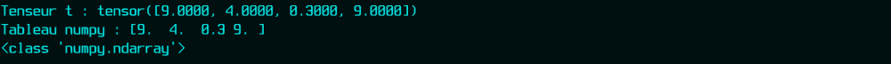

## Introduction au Tenseur


La structure de données utilisée dans PyTorch est basée sur les graphes
et les tenseurs, il est important de comprendre les opérations de base et
la définition des tenseurs.

Les tenseurs sont un moyen de représenter des données, en particulier des
données multidimensionnelles, c'est-à-dire des données numériques.

On va donc s'entraîner sur les tenseurs et leurs opérations.

```python
import torch  # On importe pytorch.
print(torch.__version__)  # On affiche sa version.

```

<details id="table-content" open>
    <summary>Table des Contenus</summary>
    <ul>
        <li><a href="#création-de-tenseur">Création de Tenseur</a>
            <ul>
            <li><a href="#la-finction-tensor">La finction tensor</a>
                <ul>
                <li><a href="#scalaire">Scalaire</a></li>
                <li><a href="#vecteur">Vecteur</a></li>
                <li><a href="#Depuis-un-tableau-numpy">Depuis un tableau numpy</a></li>
                </ul>
            </li>
            <li><a href="#la-fonction-zeros">La fonction zeros</a></li>
            <li><a href="#la-fonction-ones">La fonction ones</a></li>
            <li><a href="#la-fonction-eye">La fonction eye</a></li>
            <li><a href="#la-fonction-arange">La fonction arange</a></li>
            <li><a href="#les-fonctions-linspace-et-logspace">Les fonctions linspace et logspace</a></li>
            <!--<li><a href="#La fonction arange">La fonction arange</a></li>-->
            </ul>
        </li>
        <li><a href="#opération-sur-les-tenseur">Opération sur les tenseur</a>
            <ul>
            <li><a href="#is_tensor-et-is_storage">is_tensor et is_storage</a></li>
            <li><a href="#la-fonction-numpy">La fonction numpy</a></li>
            <li><a href="#calcule-de-gradiant">Calcule de gradiant</a></li>
            </ul>
        </li>
        <li><a href="#Générations aléatoires">Générations aléatoires</a>
            <ul>
            <li><a href="#la-fonction-rand">La fonction rand</a></li>
            <li><a href="#la-fonction-randn">La fonction randn</a></li>
            <li><a href="#la-fonction-randperm">la fonction randperm</a></li>
            </ul>
        </li>
    </ul>

</details>
<br/>

### Création de Tenseur
Même si dans PyTorch, presque tout est appelé tenseur, il existe différents
types de tenseurs.

#### La finction tensor
##### Scalaire
Le premier type de tenseur que nous allons créer s'appelle un scalaire.
Je sais que je vais te balancer un grand nombre de noms *étranges* de choses
différentes, mais il est important que tu sois au courant de tous ces
nomenclatures.

```python
# on crée un scalaire
scalar = torch.tensor(10)
print(scalar)

# on affiche le nombre de dimensions
print(f"Nombre de dimension du scalaire : {scalar.ndim}")

# on affiche les éléments
print(f"Les elements du scalaire : {scalar.item()}")


```

<!--```
tensor(10)
Nombre de dimension du scalaire : 0
Les elements du scalaire : 10
```-->


Donc, comme tu le vois, un scalaire n'a pas de dimension (`scalare.ndim = 0`)
et n'a qu'un seul élément, c'est la valeur du nombre, ici le nombre `10`.

##### Vecteur
On peut créer un tenseur à une ligne (communement appelé *vecteur*) à partir
d'un simple tableau python.

```python
vector = torch.tensor([2, 3, 90, 19, -8], dtype=torch.float32)
print(vector)

```


Le paramètre `dtype` est souvent définisable pour la plupart des fonctions
qui produisent des tenseurs en sortie. Ce paramètre permet de définir le
type des éléments du tenseur. Dans notre exemple ici, `dtype` est définit à
`torch.float32`, donc les valeurs `2`, `3`, `90`, `19`,`-8` contenues au
préalable dans le tableau python passé en argument à la fonction
`torch.tensor()` seront transformées en nombre réel simple précision
(`float32`).

##### Depuis un tableau numpy
On peut créer un tenseur depuis un tableau `numpy`.

```python
import numpy as np

# On crée le tableau numpy à partir d'un tableau python.
numpy_tab = np.array([[1, -2], [3, 4]])
# On crée ensuite le tenseur à partir du tableau numpy.
print(torch.tensor(numpy_tab))

```


#### La fonction from_numpy
Comme son nom l'indique, cette fonction permet de convertir un tableau `numpy`
en tenseur.

```python
import numpy as np
import torch


x = np.array([12, 13, 34, 9, 89])  # On crée un tableau numpy.
t = torch.from_numpy(x)
# Ce tableau est ensuite passé à la fonction from_numpy()

print(t)  # On affiche le tenseur obtenu.

```


#### La fonction zeros
Cette fonction permet de définir un tenseur nul, c'est à dire un tenseur dont
tous les entrés sont à `0`.

```python
vector_null = torch.zeros((10,))  # pour définir un vecteur nul.
matrix_null = torch.zeros((2, 4))  # pour définir une matrice nulle.
tensor_null = torch.zeros((3, 2, 4))  # pour définir un tenseur nul.

print("vecteur nul :", vector_null)
print("matrice nulle :", matrix_null)
print("tenseur nul :", tensor_null)

```


#### La fonction ones
Cette fonction permet de définir un tenseur dont tous les entrés sont à `1`.

```python
vector_ones = torch.ones((10,))  # pour définir un vecteur rempli de 1.
matrix_ones = torch.ones((2, 4))  # pour définir une matrice rempli de 1.
tensor_ones = torch.ones((3, 2, 4))  # pour définir un tenseur rempli de 1.

print("vecteur nul :", vector_ones)
print("matrice nulle :", matrix_ones)
print("tenseur nul :", tensor_ones)

```


#### La fonction eye
Comme les opérations NumPy, la fonction `eye()` permet de créer une matrice
diagonale, dont les éléments diagonaux sont des uns (1), et les éléments qui
ne sont pas dans la diagonale sont des zéros (0).

```python
# on crée une matrice de 3 lignes et 4 colonnes.
print(torch.eye(3, 4))
```


#### La fonction arange
Cette fonction permet de générer un tableau de valeurs discrettes comprises
dans un intervalle donné. Ces valeurs sont équi-distantes d'un pas bien défini.

```python
# On va générer un tableau de valeurs comprises
# entre 10 et 40 avec un pas de 2
values_2 = torch.arange(10, 40, 2)
print(values_2)

```


Par défaut, le pas vaut `1`, si tu ne le définis pas.

```python
print(torch.arange(10, 40))
```


Il faut remarquer que l'intervalle utilisé pour générer les valeurs du tableau
est **$I = [n_1; n_2[$** avec $n_1$ la valeur de départ et $n_2$ la valeur
finale. Ce qui signifie, dans les valeurs obtenues, on aura jamais la valeurs
finale $n_2$.


#### Les fonctions linspace et logspace
La fonction `linspace()` permet de générer $n$ nombres dans un intervalle
fermé $[x_1; x_2]$. Prenons l'exemple de la création de 25 points ($n = 25$)
dans un espace linéaire en commençant par la valeur 2 et terminant par 10
($[2; 10]$).

```python
print(torch.linspace(2, 10, steps=25))

```


Il s'agit donc d'une **espace linéaire**. Tout comme les espace linéaires,
les espaces logarithmiques peuvent être créés en utilisant la fonction
`logspace()`.

```python
print(torch.logspace(start=10, end=15, steps=15))
```


<!-- #### Vecteur -->
<!-- 01:27:35 -->

### Opération sur les tenseur

#### is_tensor et is_storage
On peut vérifier si un objet en Python est un objet tenseur en utilisant les
fonctions `is_tensor()` et `is_storage()`. En générale, ces deux fonctions
vérifient si l'objet est stocké en tant qu'objet tensoriel.

```python
x = [12, 13, 34, 9, 89]  # juste une liste python
print(torch.is_tensor(x))  # False
print(torch.is_storage(x))  # False

```

Maintenant, créons un objet qui contient des nombres générés de façon
aléatoire à partir de `torch`, similaire à la bibliothèque NumPy.

```python
y = torch.randn(1, 2, 3, 4, 5)
print(y)

```


Ensuite, on vérifie le type de `y`.

```python
print(torch.is_tensor(y))  # True
print(torch.is_storage(y))  # False

```

L'objet `y` est un tenseur, mais il n'est pas stocké.


#### La fonction numpy
La fonction `numpy()` permet de récupérer un tenseur sous forme de tableau
numpy.

```python
# On crée un simple tenseur.
t = torch.tensor([9., 4., 0.3, 9.])
print("Tenseur t :", t)

# On récupérer le tableau numpy du tenseur t.
numpy_tab = t.numpy()
print("Tableau numpy :", numpy_tab)
print(type(numpy_tab))  # on affiche le type.

```




#### Calcule de gradiant

```python
import torch
from torch.autograd import Variable


# Ici on crée une variable contenant un poid
W = torch.Tensor([3.0], requires_grad=True)


def forward(w, x):
    # On calcule le produit des poinds W
    # avec n'importe quelle variable
    return w * x


# on va appeller forward() avec 4.
x = 4
y = forward(W, x)
print("predict (before training): for x = {}, y = {:.2f}".format(x, y[0]))

```

```python
x_data = [11.0, 22.0, 33.0]
y_data = [21.0, 14.0, 64.0]

for epoch in range(5):
    print("\nProgress: ", epoch)
    for x, y in zip(x_data, y_data):
        y_pred = forward(W, x)  # on calcule
        y_pred.backward()  # on calcule le gradient
        print(
            "\t* x, y: ({:6.2f}, {:6.2f}) \t grad: {:6.3}".format(
                x, y, W.grad[0]
            )
        )

        # on fait la correction d'erreur en utilisant
        # la formule de la descente de gradient.
        with torch.no_grad():
            W -= 0.01 * W.grad

        # Remettre manuellement les gradients à zéro
        # après la mise à jour des poids.
        W.grad.zero_()

```


### Générations aléatoires
La génération de nombres aléatoires est très souvent utilisée en science des
données. Les nombres aléatoires peuvent être générés à partir d'une
distribution statistique, de deux valeurs quelconques ou d'une distribution
prédéfinie. 


#### La fonction rand
La distribution uniforme est définie comme une distribution où
chaque résultat a la même probabilité de se produire. Tout comme les fonctions
NumPy, les nombres aléatoires peuvent être générés dans un tenseur à l'aide de
la fonction `rand()`. 

```python
# On va générer 10 nombres aléatoires issus d'une distribution 
# uniforme entre les valeurs 0 et 1.
uniform_random_numbers = torch.rand(10)
print(uniform_random_numbers)

```


#### La fonction randn
Les nombres aléatoires d'une distribution normale avec une moyenne
arithmétique de 0 et un écart type de 1 peuvent également être générés dans
un tenseur en utilisant la fonction `randn()`.

```python
# On va générer 10 nombres aléatoires issus d'une distribution normale, 
# avec une moyenne = 0 et un écart-type = 1
normal_rand_numbers = torch.randn(10)
print(normal_rand_numbers)

```


`randn()` génère un tableau à `n` dimensions en fonction du paramètrage. Si tu
renseigne un seul paramètre comme dans l'exemple ci-dessus, alors tu auras
un tableau à une dimension. Si tu renseigne deux paramètres alors tu auras un
tableau à deux dimensions, et ainsi de suite...

```python
# Exemple de génération d'un tableau à 3 dimensions
tab_3d = torch.randn(2, 3, 5)
print(tab_3d)

```


Dans ce résultat, on a `2` matrices à `3` lignes et `5` colonnes. Je pense que
tu as compris.


#### la fonction randperm
Cette fonction permet de sélectionner des valeurs de façon aléatoire
dans une plage ou intervalle de valeurs comprises entre 0 et `n`.

```python
# On va générer des valeurs de façon aléatoire comprises entre 0 et 10.
random_values = torch.randperm(10)
print(random_values)

```


Si tu recommence l'execution de `torch.randperm(10)`, tu auras un résultat
différent du précédent. D'ailleur, je suis sûre que le résultat que tu as
obtenu chez toi est différent de celui qui ce trouve sur la capture ci-dessus.

```python
# Allez, exécutons 3 fois.
print(torch.randperm(10))
print(torch.randperm(10))
print(torch.randperm(10))

```


Je crois que tu as compris et si tu analyses bien les résultats obtenus avec
l'argument `10`, tu remarqueras que `randperm()` ne fait que des permutations,
déjà, son nom nous donne un indice : *rand perm*, *random permutation*.
Du coup, le nombre de possibilités de tenseurs qu'on peut avoir avec
`torch.randperm(10)` est égal à **3 628 800**.

> Comment ça ?

C'est simple, j'ai juste calculer $10!$ et se lit : *factoriel 10*. Tu peux
le calculer avec python.

```python
import math
print(math.factorial(10))

```

Donc avec l'argument 10 passé à `torch.randperm()` tu peux avoir 3 628 800
de tenseurs possibles. Donc, de façon générale, pour une valeur `n` passé
à `torch.randperm()`, tu peux obtenir $n!$ tenseurs possibles.


<!-- #### Les fonctions argmin et argmax -->


<br/>
<br/>

- Je passe au chapitre **suivant** :
[Réseaux de neuronnes](../nn/README.md)
- [<--](../intro/README.md) Je reviens au chapitre **précédent** :
[Introduction](../intro/README.md)

