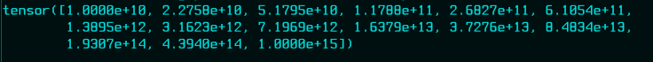

## Introduction au Tenseur


La structure de données utilisée dans PyTorch est basée sur les graphes et les tenseurs,
il est important de comprendre les opérations de base et la définition des tenseurs.

Les tenseurs sont un moyen de représenter des données, en particulier des données multidimensionnelles, c'est-à-dire des données numériques.

On va donc s'entraîner sur les tenseurs et leurs opérations.

```python
import torch  # On importe pytorch.
print(torch.__version__)  # On affiche sa version.

```

<details id="table-content" open>
    <summary>Table des Contenus</summary>
    <ul>
        <li><a href="#pourquoi-pytorch">Pourquoi PyTorch ?</a></li>
        <li><a href="#création-de-tenseur">Création de Tenseur</a>
            <ul>
                <li><a href="#scalaire">Scalaire</a></li>
                <li><a href="#vecteur">Vecteur</a></li>
            </ul>
        </li>
    </ul>

</details>
<br/>

### Création de Tenseur
Même si dans PyTorch, presque tout est appelé tenseur, il existe différents types de tenseurs.

#### Scalaire
Le premier type de tenseur que nous allons créer s'appelle un scalaire. Je sais que je vais te balancer un grand nombre de noms *étranges* de choses différentes, mais il est important que tu sois au courant de tous ces nomenclatures.

```python
# on crée un scalaire
scalar = torch.tensor(10)
print(scalar)

# on affiche le nombre de dimensions
print(f"Nombre de dimension du scalaire : {scalar.ndim}")

# on affiche les éléments
print(f"Les elements du scalaire : {scalar.item()}")


```

```
tensor(10)
Nombre de dimension du scalaire : 0
Les elements du scalaire : 10
```

Donc, comme tu le vois, un scalaire n'a pas de dimension (`scalare.ndim = 0`) et n'a qu'un seul élément, c'est la valeur du nombre, ici le nombre `10`.

<!-- #### Vecteur -->
<!-- 01:27:35 -->

### Opération sur les tenseur

#### les fonctions is_tensor et is_storage
On peut vérifier si un objet en Python est un objet tenseur en utilisant les fonctions `is_tensor()` et `is_storage()`. En générale, ces deux fonctions vérifient si l'objet est stocké en tant qu'objet tensoriel.

```python
x = [12, 13, 34, 9, 89]  # juste une liste python
print(torch.is_tensor(x))  # False
print(torch.is_storage(x))  # False

```

Maintenant, créons un objet qui contient des nombres générés de façon aléatoire à partir de `torch`, similaire à la bibliothèque NumPy.

```python
y = torch.randn(1, 2, 3, 4, 5)
print(y)

```


Ensuite, on vérifie le type de `y`.

```python
print(torch.is_tensor(y))  # True
print(torch.is_storage(y))  # False

```

L'objet `y` est un tenseur, mais il n'est pas stocké.

#### La fonction from_numpy
Comme son nom l'indique, cette fonction permet de convertir un tableau `numpy` en tenseur.

```python
import numpy as np
import torch


x = np.array([12, 13, 34, 9, 89])  # On crée un tableau numpy.
t = torch.from_numpy(x)  # Ce tableau est ensuite passé à la fonction from_numpy()
print(t)  # On affiche le tenseur obtenu.

```


#### La fonction eye
Comme les opérations NumPy, la fonction `eye()` permet de créer une matrice diagonale, dont les éléments diagonaux sont des uns (1), et les éléments qui ne sont pas dans la diagonale sont des zéros (0).

```python
# on crée une matrice de 3 lignes et 4 colonnes.
print(torch.eye(3, 4))
```


#### Les fonctions linspace et logspace
La fonction `linspace()` permet de générer $n$ nombres dans un intervalle fermé $[x_1; x_2]$. Prenons l'exemple de la création de 25 points ($n = 25$) dans un espace linéaire en commençant par la valeur 2 et terminant par 10 ($[2; 10]$).

```python
print(torch.linspace(2, 10, steps=25))

```


Il s'agit donc d'une **espace linéaire**. Tout comme les espace linéaires, les espaces logarithmiques peuvent être créés en utilisant la fonction `logspace()`.

```python
print(torch.logspace(start=10, end=15, steps=15))
```



#### Les fonctions de générations aléatoires
La génération de nombres aléatoires est très souvent utilisée en science des données. Les nombres aléatoires peuvent être générés à partir d'une distribution statistique, de deux valeurs quelconques ou d'une distribution prédéfinie. La distribution uniforme est définie comme une distribution où chaque résultat a la même probabilité de se produire. Tout comme les fonctions NumPy, les nombres aléatoires peuvent être générés à l'aide de l'exemple suivant.

```python
# On va générer 10 nombres aléatoires issus d'une distribution 
# uniforme entre les valeurs 0 et 1.
uniform_random_numbers = torch.rand(10)
print(uniform_random_numbers)

```


Les nombres aléatoires d'une distribution normale avec une moyenne arithmétique de 0 et un écart type de 1 peuvent également être créés comme suit.

```python
# On va générer 10 nombres aléatoires issus d'une distribution normale, 
# avec une moyenne = 0 et un écart-type = 1
normal_rand_numbers = torch.randn(10)
print(normal_rand_numbers)

```


<br/>
<br/>

<!-- - Je passe à la session **suivante**: [Introduction](./intro/README.md) -->
[<--](../intro/README.md) Je reviens à la session **précédente**: [Introduction](../intro/README.md)

